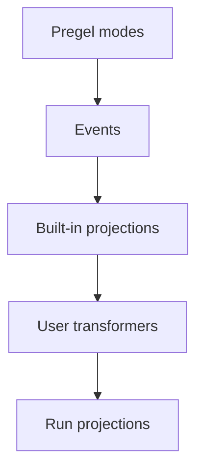

事件 streaming 是大多数 LangGraph 应用代码推荐的进程内 streaming 模型。它返回一个 run stream 对象, 该对象可以同时以多种方式被消费。

## 快速开始

:::python
```py
stream = graph.stream_events({
    "messages": [{"role": "user", "content": "What is 42 * 17?"}],
}, version="v3")

for message in stream.messages:
    for token in message.text:
        print(token, end="", flush=True)

final_state = stream.output
```
:::

:::js
```ts
const stream = await graph.streamEvents(
  { messages: [{ role: "user", content: "What is 42 * 17?" }] },
  { version: "v3" }
);

for await (const message of stream.messages) {
  for await (const token of message.text) {
    process.stdout.write(token);
  }
}

const finalState = await stream.output;
```
:::

若要针对部署在 Agent Server 之后的 graph 进行 stream, 见 [LangSmith Streaming API](/langsmith/streaming)。

## 各部分如何配合

streaming 栈有两个主要层:

1. **streaming** 从 Pregel 引擎发出原始 graph 执行事件。
2. **事件 streaming** 规范化这些事件, 让它们流经 stream transformers, 并暴露类型化投影。

<div className="my-6 rounded-xl border bg-gray-50 p-4 dark:bg-gray-900">
  <div className="mx-auto max-w-2xl space-y-2 text-sm">
    <div className="rounded-lg border border-slate-300 bg-white p-3 text-center dark:border-slate-700 dark:bg-slate-950">
      <div className="font-semibold text-slate-900 dark:text-slate-100">Pregel 引擎</div>
      <div className="mt-1 text-xs text-slate-600 dark:text-slate-300">运行 graph 步骤</div>
    </div>
    <div className="text-center text-xs font-medium uppercase tracking-wide text-slate-500 dark:text-slate-400">发出</div>
    <div className="rounded-lg border border-orange-300 bg-orange-50 p-3 text-center dark:border-orange-800 dark:bg-orange-950">
      <div className="font-semibold text-orange-900 dark:text-orange-100">原始 Pregel 事件</div>
      <div className="mt-1 text-xs text-orange-700 dark:text-orange-300"><code>updates</code>, <code>values</code>, <code>messages</code>, <code>custom</code>, <code>checkpoints</code>, <code>tasks</code>, <code>debug</code></div>
    </div>
    <div className="text-center text-xs font-medium uppercase tracking-wide text-slate-500 dark:text-slate-400">发送至</div>
    <div className="rounded-lg border border-blue-300 bg-blue-50 p-3 text-center dark:border-blue-800 dark:bg-blue-950">
      <div className="font-semibold text-blue-900 dark:text-blue-100">事件路由器</div>
      <div className="mt-1 text-xs text-blue-700 dark:text-blue-300">让每个事件流经 transformer 流水线</div>
    </div>
    <div className="text-center text-xs font-medium uppercase tracking-wide text-slate-500 dark:text-slate-400">级联穿过</div>
    <div className="rounded-lg border border-green-300 bg-green-50 p-3 dark:border-green-800 dark:bg-green-950">
      <div className="font-semibold text-green-900 dark:text-green-100">stream transformers</div>
      <div className="mt-2 grid gap-2 text-xs text-green-800 dark:text-green-200 sm:grid-cols-4">
        <div className="rounded border border-green-200 bg-white px-2 py-1 dark:border-green-800 dark:bg-green-950">ValuesTransformer</div>
        <div className="rounded border border-green-200 bg-white px-2 py-1 dark:border-green-800 dark:bg-green-950">MessagesTransformer</div>
        <div className="px-2 py-1 text-center text-green-600 dark:text-green-300">...</div>
        <div className="rounded border border-green-200 bg-white px-2 py-1 dark:border-green-800 dark:bg-green-950">自定义 transformer</div>
      </div>
    </div>
    <div className="text-center text-xs font-medium uppercase tracking-wide text-slate-500 dark:text-slate-400">产出</div>
    <div className="rounded-lg border border-purple-300 bg-purple-50 p-3 text-center dark:border-purple-800 dark:bg-purple-950">
      <div className="font-semibold text-purple-900 dark:text-purple-100">事件 stream</div>
      <div className="mt-1 text-xs text-purple-700 dark:text-purple-300">为应用代码投影出的事件</div>
    </div>
  </div>
</div>

事件路由器是两层之间的桥梁。它接收规范化后的 Pregel 事件, 并让每个事件流经已注册的 stream transformers。内置 transformer 会创建标准投影, 例如 `stream.messages`、`stream.values`、`stream.subgraphs` 与 `stream.output`。自定义 transformer 可以在 `stream.extensions` 下添加特定于应用的投影。

## 事件 streaming 提供什么

run stream 在单一底层事件流之上暴露类型化投影:

| 投影 | 用途 |
| ---------- | --- |
| `stream` | 迭代每一个协议事件。 |
| `stream.messages` | Stream chat model 消息与 token 增量。 |
| `stream.values` | 迭代 state snapshot 并等待最终值。 |
| `stream.output` | 等待最终输出。 |
| `stream.subgraphs` | 发现并观察嵌套的 graph 执行。 |
| `stream.interrupts` | 检查 human-in-the-loop interrupt payload。 |
| `stream.interrupted` | 检查该 run 是否为等待人工输入而暂停。 |
| `stream.extensions` | 消费自定义 stream transformer 投影。 |

多个消费者可以并发读取这些投影。读取 `stream.messages` 不会消耗 `stream.values`、`stream.subgraphs` 或 `stream.output` 所需的事件。

事件 streaming 位于 [streaming](/oss/langgraph/streaming) 之上的一层, 后者通过 `stream_mode` 模式暴露原始 graph 执行事件, 例如 `updates`、`values`、`messages`、`custom`、`checkpoints`、`tasks` 与 `debug`。当你需要对这些模式进行底层访问时, 使用 streaming; 当应用代码能从类型化投影中受益时, 使用事件 streaming。

## Stream 消息

对 chat model 输出使用 `stream.messages`:

:::python
```py
stream = graph.stream_events(input, version="v3")

for message in stream.messages:
    text = str(message.text)
    usage = message.output.usage_metadata

    print(text)
    print(usage)
```
:::

:::js
```ts
const stream = await graph.streamEvents(input, { version: "v3" });

for await (const message of stream.messages) {
  const text = await message.text;
  const usage = await message.usage;

  console.log(text);
  console.log(usage);
}
```
:::

:::python
在同步代码中, `message.text` 是可迭代的。逐 token 迭代它以获得输出, 或调用 `str(message.text)` 获取完整文本。

`message.reasoning` 暴露 reasoning 增量, `message.tool_calls` 暴露 tool-call 参数块。如果你需要按精确到达顺序获取 text、reasoning 与 tool-call 块, 请迭代该消息 stream 的原始事件, 而不是分别迭代各个投影。
:::

:::js
`message.text` 既是 async 可迭代对象, 也是类 promise 的值。逐 token 迭代它以获得输出, 或 await 它获取完整文本。
:::

## Stream subgraph

使用 `stream.subgraphs` 观察嵌套的 graph 工作, 而无需解析 namespace 字符串:

:::python
```py
stream = graph.stream_events(input, version="v3")

for subgraph in stream.subgraphs:
    print(subgraph.graph_name, subgraph.path)

    for message in subgraph.messages:
        print(message.text)
```
:::

:::js
```ts
const stream = await graph.streamEvents(input, { version: "v3" });

for await (const subgraph of stream.subgraphs) {
  console.log(subgraph.name, subgraph.path);

  for await (const message of subgraph.messages) {
    console.log(await message.text);
  }
}
```
:::

`subgraph.graph_name` 是已编译 graph 或 agent 的 `name`。从 tool 中派发的具名 agent(例如通过 Deep Agents 的 `task` tool 调用的 `create_agent(name=...)`)会以该名称出现在这里, 而开启该 scope 的 `lifecycle` 事件会携带一个 `cause`, 指回发起派发的 tool call。更多信息见 [Lifecycle](#lifecycle)。

关于特定于产品的 stream, 见 [Deep Agents streaming](/oss/deepagents/event-streaming) 的 subagent stream, 以及 [LangChain agent streaming](/oss/langchain/streaming) 的 tool call 与 middleware 事件。

## Stream state

使用 `stream.values` 在每一步之后 stream 完整 state snapshot:

:::python
```py
stream = graph.stream_events(input, version="v3")

for snapshot in stream.values:
    print(snapshot)

final_state = stream.output
```
:::

:::js
```ts
const stream = await graph.streamEvents(input, { version: "v3" });

for await (const snapshot of stream.values) {
  console.log(snapshot);
}

const finalState = await stream.output;
```
:::

## Stream 多个投影

:::python
在 async 代码中进行并发消费, 请将 `astream_events` 与 `asyncio.gather` 配合使用:

```py
import asyncio

stream = await graph.astream_events(input, version="v3")

async def consume_messages():
    async for message in stream.messages:
        print(f"[llm] node={message.node}")

async def consume_subgraphs():
    async for subgraph in stream.subgraphs:
        print(f"[subgraph] path={subgraph.path}")

await asyncio.gather(consume_messages(), consume_subgraphs())
```

在同步代码中, 使用 `stream.interleave(...)` 按严格的到达顺序消费多个投影:

```py
stream = graph.stream_events(input, version="v3")

for name, item in stream.interleave("values", "messages", "subgraphs"):
    if name == "values":
        print(f"[state] keys={list(item)}")
    elif name == "messages":
        print(f"[llm] node={item.node}")
    elif name == "subgraphs":
        print(f"[subgraph] path={item.path}")
```
:::

:::js
在 JavaScript 中需要多个投影时, 使用并发消费者:

```ts
await Promise.all([
  (async () => {
    for await (const message of stream.messages) {
      console.log(await message.text);
    }
  })(),
  (async () => {
    for await (const subgraph of stream.subgraphs) {
      console.log(subgraph.path);
    }
  })(),
]);
```
:::

## 在 interrupt 之后恢复

当 graph 为等待人工输入而暂停时, 检查 `stream.interrupted` 与 `stream.interrupts`, 然后再次调用 `stream_events(..., version="v3")` 并传入 `Command` 来恢复。

恢复要求 graph 使用 checkpointer 编译, 并且 config 携带一个 thread ID — 见 [persistence](/oss/langgraph/persistence)。

:::python
```py
from langgraph.types import Command

stream = graph.stream_events(input, version="v3")

for message in stream.messages:
    print(message.text)

if stream.interrupted:
    print(stream.interrupts)

stream = graph.stream_events(
    Command(resume={"decisions": [{"type": "approve"}]}),
    version="v3",
)
final_state = stream.output
```
:::

:::js
```ts
import { Command } from "@langchain/langgraph";

let stream = await graph.streamEvents(input, { version: "v3" });

for await (const message of stream.messages) {
  console.log(await message.text);
}

if (stream.interrupted) {
  console.log(stream.interrupts);
}

stream = await graph.streamEvents(
  new Command({ resume: { decisions: [{ type: "approve" }] } }),
  { version: "v3" }
);
const finalState = await stream.output;
```
:::

## Stream 所有协议事件

当你需要原始协议事件 stream 时, 直接使用 run 对象本身:

:::python
```py
stream = graph.stream_events({
    "messages": [{"role": "user", "content": "What is 42 * 17?"}],
}, version="v3")

for event in stream:
    namespace = event["params"]["namespace"]
    print(namespace, event["method"], event["params"]["data"])
```
:::

:::js
```ts
const stream = await graph.streamEvents(
  { messages: [{ role: "user", content: "What is 42 * 17?" }] },
  { version: "v3" }
);

for await (const event of stream) {
  const namespace = event.params.namespace;
  console.log(namespace, event.method, event.params.data);
}
```
:::

每个事件都是一个 `ProtocolEvent` 封装, 内含特定于通道的 payload。transformer 的 `process(event)` 接收的正是这种形状。

:::python
```py
class ProtocolEvent(TypedDict):
    seq: int                    # strictly increasing within a run; use for ordering
    method: str                 # channel name: "messages", "values", "updates", "custom", "tools", "lifecycle", ...
    params: ProtocolEventParams


class ProtocolEventParams(TypedDict):
    namespace: list[str]        # path of "<name>:<runtime_id>" segments from the root graph; [] is the root
    timestamp: int              # wall-clock milliseconds; can drift, don't rely on for ordering
    data: Any                   # channel-specific payload; shape depends on `method`
```
:::

:::js
```ts
interface ProtocolEvent {
  readonly seq: number;         // strictly increasing within a run; use for ordering
  readonly method: string;      // channel name: "messages", "values", "updates", "custom", "tools", "lifecycle", ...
  readonly params: {
    readonly namespace: string[];  // path of "<name>:<runtime_id>" segments from the root graph; [] is the root
    readonly timestamp: number;    // wall-clock milliseconds; can drift, don't rely on for ordering
    readonly node?: string;        // graph node that emitted this event, when applicable
    readonly data: unknown;        // channel-specific payload; shape depends on `method`
  };
}
```
:::

`namespace` 是从根 graph 到发出该事件的 scope 的路径。根是空数组 `[]`。每个子执行会添加一个 `"name:runtime_id"` 段, 因此 subgraph 内部的嵌套 tool call 看起来像 `["researcher:6f4d", "tools:91ac"]`。`:` 之前的名称是稳定的 graph 或 node 名称; 后缀是每次调用的 runtime ID。当你只关心某个特定子树时, 请自行按 namespace 过滤原始事件 — `stream.subgraphs` 已为嵌套 graph 执行做好了这件事。

## 通道与事件生命周期

原始事件在通道上流动。通道名称会作为事件的 `method` 出现; 每个通道发出特定的事件形状。

| 通道 | 用途 |
| ------- | ------- |
| `values` | 完整的 graph state snapshot。 |
| `updates` | 每个 node 的 state 增量。 |
| `messages` | 以 content block 为中心的 chat model 输出。 |
| `tools` | tool call 的启动、stream 输出、完成与错误事件。 |
| `lifecycle` | run、subgraph 与 subagent 的状态变化。 |
| `checkpoints` | 用于分支与 time travel 的轻量 checkpoint 封装。 |
| `input` | human-in-the-loop 的输入请求与响应。 |
| `tasks` | Pregel task 的创建与结果事件。 |
| `custom` | 来自 graph 代码的用户自定义 payload。 |
| `custom:<name>` | 应用自定义的 stream transformer 输出。 |

类型化投影(`stream.messages`、`stream.values` 等)由这些通道构建而成。当你直接迭代 run 对象时, 通道名称会作为原始事件上的 `method` 字段出现。

### 消息

`messages` 通道将输出建模为 content block。数据的 `event` 字段是以下之一:

- `message-start`
- `content-block-start`
- `content-block-delta`
- `content-block-finish`
- `message-finish`

content block 具有明确的边界: 一个块开始、发出零个或多个增量, 然后在该消息中的下一个块开始之前结束。这让 token streaming、reasoning 块、tool-call 块与多模态内容变得显式, 而无需依赖特定于 provider 的格式。`message-finish` 可能包含 token 用量; 不可恢复的 model 调用失败会以消息错误事件的形式到达。

若要直接消费原始 content-block 事件, 而不使用 `stream.messages` 投影:

:::python
```py
for event in stream:
    if event["method"] != "messages":
        continue

    data = event["params"]["data"][0]
    if not isinstance(data, dict):
        continue
    if data.get("event") != "content-block-delta":
        continue

    block = data.get("delta") or {}
    if block.get("type") == "text-delta":
        print(block.get("text", ""), end="", flush=True)
    elif block.get("type") == "reasoning-delta":
        print(f"[thinking]{block.get('reasoning', '')}", end="", flush=True)
```
:::

:::js
```ts
for await (const event of stream) {
  if (event.method !== "messages") continue;

  const data = event.params.data;
  if (data.event !== "content-block-delta") continue;

  const block = data.delta ?? {};
  if (block.type === "text-delta") {
    process.stdout.write(block.text ?? "");
  } else if (block.type === "reasoning-delta") {
    process.stdout.write(`[thinking]${block.reasoning ?? ""}`);
  }
}
```
:::

### Tools

`tools` 通道暴露 tool 执行。数据的 `event` 字段是以下之一:

- `tool-started`
- `tool-output-delta`
- `tool-finished`
- `tool-error`

tool 事件通过 tool call ID 关联, 因此一次 tool 执行可以回连到它在 `messages` 通道上发起它的 tool-call content block。

### 生命周期

`lifecycle` 通道追踪根 run、subgraph 与 subagent 的状态。数据的 `event` 字段是以下之一:

- `started`
- `running`
- `completed`
- `failed`
- `interrupted`

除 `event` 之外, lifecycle 数据还可能包含可选的 `graph_name`、`error` 与 `cause`, 用于描述某个子 scope 为何启动(父 tool call、扇出 send、edge 转移)。

## 构建你自己的投影

stream transformer 是事件 streaming 中的投影层。它们观察协议事件, 维护自身 state, 并暴露 run 的派生视图 — 例如 tool 活动、token 总数、进度事件、artifact, 或供另一种协议使用的消息。`StreamChannel` 是 transformer 用来发布这些视图的投影原语。

内置投影(`stream.messages`、`stream.values`、`stream.subgraphs`、`stream.output`)与特定于产品的投影(LangChain 的 `stream.tool_calls`、Deep Agents 的 `stream.subagents`)本身就是使用同一套 contract 的 transformer。用户 transformer 通过编译时或调用时注册叠加在其上, 它们的投影出现在 `stream.extensions` 下。

当现有投影不匹配应用所需的形状时, 就编写一个。

### transformer 如何工作

事件 streaming 从 LangGraph Pregel 引擎的 streaming 输出开始。runtime 将这些数据块规范化为协议事件, 然后由 stream 处理器让每个事件流经一叠 stream transformers。



stream 处理器是单个 stream 的中心分发器。对于每个协议事件, 它会:

1. 按顺序调用每个已注册 transformer 的 `process(event)` 钩子。
2. 将具名 `StreamChannel` 的 push 接回协议事件 stream。
3. 将事件存入 run stream, 除非某个 transformer 抑制它。
4. 在 run 结束时对每个 transformer 调用 `finalize()` 或 `fail()`。

transformer 是观察式的。它们不会回调 graph runtime。相反, 它们消费事件, 并把派生值推送进 `StreamChannel`、promise 或其他投影对象。

### transformer 形态

一个 transformer 实现 `StreamTransformer` 接口:

:::python
```py
from langgraph.stream import ProtocolEvent, StreamTransformer


class MyTransformer(StreamTransformer):
    def init(self) -> dict:
        ...

    def process(self, event: ProtocolEvent) -> bool:
        ...

    def finalize(self) -> None:
        ...

    def fail(self, err: BaseException) -> None:
        ...
```
:::

:::js
```ts
interface StreamTransformer<TProjection = unknown> {
  init(): TProjection;
  process(event: ProtocolEvent): boolean;
  finalize?(): void | PromiseLike<void>;
  fail?(err: unknown): void;
}
```
:::

- `init()` 创建投影对象。用户 transformer 的投影出现在 `stream.extensions` 下。
- `process()` 观察每个协议事件。`ProtocolEvent` 的形状见 [Stream all protocol events](#stream-all-protocol-events)。仅当你确实想要抑制原始事件时才返回 `false`。
- `finalize()` 在 stream 成功结束后关闭或 resolve 非通道投影。
- `fail()` 将错误传播给非通道投影。

### 声明所需的 stream mode

`required_stream_modes` 控制底层 graph 在 stream 期间发出哪些 Pregel stream mode。runtime 取所有已注册 transformer 的 `required_stream_modes` 的并集, 并将该并集作为 `stream_mode` 参数传给 graph 的 `.stream()` 调用。**没有被任何 transformer 请求的 mode 永远不会被发出** — 声明 `("custom",)` 正是让 `custom` 事件在整个 run 中流动的原因。

:::python
```py
class CustomTransformer(StreamTransformer):
    required_stream_modes = ("custom",)  # [!code highlight]

    def process(self, event: ProtocolEvent) -> bool:
        if event["method"] == "custom":
            ...
        return True
```
:::

`process()` 接收 graph 发出的每一个事件, 并负责按 `event["method"]` 进行过滤。该声明开启上游发出; 它不会收窄 `process()` 所看到的内容。有效值是 Pregel stream mode: `"messages"`、`"tools"`、`"custom"`、`"values"`、`"updates"`、`"checkpoints"`、`"tasks"`、`"debug"`。每个 transformer 必须声明它所要处理的每一个 mode — 被省略的 mode 不会被 graph 发出, 也永远不会到达 `process()`。

### StreamChannel

`StreamChannel` 是 transformer 用来 stream 值的投影原语。它总是在 `stream.extensions.<name>` 上暴露一个可迭代 stream。构造函数参数决定每次 `push()` 是否也会作为 `custom:<name>` 事件流入 run 的主事件 stream — 也就是说, 在迭代原始协议事件时, 该投影的值是否会显现。

:::js
| 需求 | 用法 |
| ---- | --- |
| 仅侧信道投影 | `new StreamChannel<T>()` |
| 同时让每次 push 流入主事件 stream | `new StreamChannel<T>(name)` |
:::

:::python
| 需求 | 用法 |
| ---- | --- |
| 仅侧信道投影 | `StreamChannel()` |
| 同时让每次 push 流入主事件 stream | `StreamChannel(name)` |
:::

具名通道的 payload 必须可序列化, 因为每个被推送的值还会在主 stream 中变成一个 `custom:<name>` 协议事件。请将 promise、async 可迭代对象、类实例以及其他进程内句柄保留在匿名通道中。

stream 处理器负责通道生命周期。一旦 `init()` 返回通道, 处理器会在 run 结束时为你关闭或使其失败。transformer 只负责 push 值。

### 示例: 具名通道

向 `StreamChannel` 传入字符串名称, 即可通过 `stream.extensions` 暴露一个 streaming 投影, *并*将每个被推送的值作为 `custom:<name>` 协议事件转发到 run 的主事件 stream 中:

:::python
```py
from typing import TypedDict

from langgraph.stream import ProtocolEvent, StreamChannel, StreamTransformer


class ToolActivity(TypedDict):
    name: str
    status: str


class ToolActivityTransformer(StreamTransformer):
    required_stream_modes = ("tools",)

    def __init__(self, scope: tuple[str, ...] = ()) -> None:
        super().__init__(scope)
        self.activity = StreamChannel[ToolActivity]("tool_activity")

    def init(self) -> dict:
        return {"tool_activity": self.activity}

    def process(self, event: ProtocolEvent) -> bool:
        if event["method"] != "tools":
            return True

        data = event["params"]["data"]
        if isinstance(data, dict) and data.get("tool_name") and data.get("event"):
            status = "error" if data["event"] == "tool-error" else "started"
            self.activity.push({"name": data["tool_name"], "status": status})
        return True
```
:::

:::js
```ts
import { StreamChannel } from "@langchain/langgraph";

const toolActivityTransformer = () => {
  const activity = new StreamChannel<{
    name: string;
    status: "started" | "finished" | "error";
  }>("toolActivity");

  return {
    init: () => ({ toolActivity: activity }),
    process(event) {
      if (event.method === "tools") {
        const data = event.params.data as { tool_name?: string; event?: string };
        if (data.tool_name && data.event) {
          activity.push({
            name: data.tool_name,
            status: data.event === "tool-error" ? "error" : "started",
          });
        }
      }
      return true;
    },
  };
};
```
:::

### 示例: 匿名通道

若不传入名称, 该通道仅为侧信道投影 — 可在 `stream.extensions` 上访问, 但对迭代原始事件的消费者不可见。对于持有无法序列化到主事件 stream 上的进程内句柄(promise、async 可迭代对象、类实例)的投影, 这是正确的选择。

下面的示例将一个匿名通道与 `get_stream_writer` 搭配使用, 前者让 graph node 发出 `custom` 通道事件, 随后 transformer 会把这些事件汲取到投影中:

:::python
```py
from langgraph.config import get_stream_writer
from langgraph.stream import ProtocolEvent, StreamChannel, StreamTransformer


def node(state):
    writer = get_stream_writer()
    writer({"kind": "progress", "message": "retrieving context"})
    return state


class CustomTransformer(StreamTransformer):
    required_stream_modes = ("custom",)

    def __init__(self, scope: tuple[str, ...] = ()) -> None:
        super().__init__(scope)
        self.log = StreamChannel()

    def init(self) -> dict:
        return {"custom": self.log}

    def process(self, event: ProtocolEvent) -> bool:
        if event["method"] == "custom":
            self.log.push(event["params"]["data"])
        return True


stream = graph.stream_events(input, version="v3", transformers=[CustomTransformer])

for item in stream.extensions["custom"]:
    print(item)
```
:::

:::js
```ts
import { StreamChannel } from "@langchain/langgraph";

const customTransformer = () => {
  const custom = new StreamChannel<unknown>();

  return {
    init: () => ({ custom }),
    process(event) {
      if (event.method === "custom") {
        custom.push(event.params.data);
      }
      return true;
    },
  };
};
```
:::

### 示例: 最终值投影

当投影不应流入主事件 stream 时, 使用匿名 stream、promise 或其他进程内对象:

:::python
```py
from langgraph.stream import ProtocolEvent, StreamChannel, StreamTransformer


class StatsTransformer(StreamTransformer):
    required_stream_modes = ("messages",)

    def __init__(self, scope: tuple[str, ...] = ()) -> None:
        super().__init__(scope)
        self.total_tokens = 0
        self.total_tokens_log = StreamChannel[int]()

    def init(self) -> dict:
        return {"total_tokens": self.total_tokens_log}

    def process(self, event: ProtocolEvent) -> bool:
        data = event["params"]["data"]
        if isinstance(data, dict):
            usage = data.get("usage") or {}
            self.total_tokens += usage.get("output_tokens") or 0
        return True

    def finalize(self) -> None:
        self.total_tokens_log.push(self.total_tokens)
        self.total_tokens_log.close()
```
:::

:::js
```ts
const statsTransformer = () => {
  let totalTokens = 0;
  let resolveTotal!: (value: number) => void;
  const totalTokensPromise = new Promise<number>((resolve) => {
    resolveTotal = resolve;
  });

  return {
    init: () => ({ totalTokens: totalTokensPromise }),
    process(event) {
      if (event.method === "messages") {
        const data = event.params.data as { usage?: { output_tokens?: number } };
        totalTokens += data.usage?.output_tokens ?? 0;
      }
      return true;
    },
    finalize: () => resolveTotal(totalTokens),
  };
};
```
:::

### 在调用时或编译时注册

在本地试验时, 在调用时传入 transformer:

:::python
```py
stream = graph.stream_events(
    input,
    version="v3",
    transformers=[StatsTransformer, ToolActivityTransformer],
)
```
:::

:::js
```ts
const stream = await graph.streamEvents(input, {
  version: "v3",
  transformers: [statsTransformer, toolActivityTransformer],
});
```
:::

当该 graph 的每次 run 都应产出该投影时, 将 transformer 编译进 graph:

:::python
```py
graph = builder.compile(
    transformers=[StatsTransformer, ToolActivityTransformer],
)
```
:::

:::js
```ts
const graph = builder.compile({
  transformers: [statsTransformer, toolActivityTransformer],
});
```
:::

### 内置: `ToolCallTransformer`

:::python
LangGraph 内置提供 `ToolCallTransformer`。注册它即可在普通的 `StateGraph` 上暴露 `stream.tool_calls`:

```py
from langgraph.prebuilt import ToolCallTransformer

stream = graph.stream_events(input, version="v3", transformers=[ToolCallTransformer])

for tool_call in stream.tool_calls:
    print(tool_call.tool_name, tool_call.input)
```
:::

## 相关

LangGraph 定义了 streaming 原语。若要在 LangChain 或 Deep Agents 中使用 streaming, 请查阅相关产品文档:

- [LangChain agent streaming](/oss/langchain/event-streaming) 涵盖 ReAct 风格的 agent 消息、tool call 与 middleware 更新。
- [Deep Agents streaming](/oss/deepagents/event-streaming) 涵盖 subagent、嵌套消息与 subagent tool call。
- [LangChain frontend patterns](/oss/langchain/frontend/overview) 与 [LangGraph frontend patterns](/oss/langgraph/frontend/overview) 展示了构建在 stream 出来的 state 之上的 UI 用例。
- [LangSmith Streaming API](/langsmith/streaming) 涵盖针对部署在 Agent Server 之后的 graph 进行 stream。

线缆级(wire-level)的事件与命令格式定义在 [Agent Protocol](https://github.com/langchain-ai/agent-protocol) 仓库中, 并可作为 PyPI 上的 [`langchain-protocol`](https://pypi.org/project/langchain-protocol/) 与 npm 上的 [`@langchain/protocol`](https://www.npmjs.com/package/@langchain/protocol) 使用。

{/* 源文档版本: src/oss/langgraph/event-streaming.mdx @ 6ae8d498a (2026-06-04) | 翻译日期: 2026-10-01 */}
