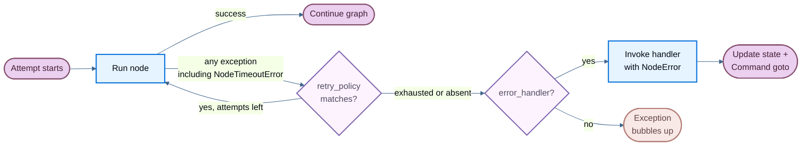

当某个 node 失败时 —— 无论是由于缓慢的外部 API、瞬时网络错误, 还是未处理的异常 —— LangGraph 都为你提供了三种可组合的应对机制:

- [**重试**](#retries): 根据异常类型与退避设置自动重新运行失败的尝试
- [**超时**](#timeouts): 限制单次尝试可以运行多久
- [**错误处理**](#error-handling): 在所有重试耗尽之后运行一个恢复函数

:::python
使用 [**`set_node_defaults`**](#graph-defaults) 为所有 node 一次性配置这些机制, 而不必在每次 `add_node` 调用时重复配置。
:::

:::js
使用 [**`setNodeDefaults`**](#graph-defaults) 为所有 node 一次性配置这些机制, 而不必在每次 `addNode` 调用时重复配置。
:::

这些机制以固定的顺序组合: 当某次 node 尝试抛出任何异常时 (包括因超时产生的 @[`NodeTimeoutError`]), 由重试策略决定是否重试。只有在重试耗尽之后, error handler 才会运行。

若要在 superstep 边界干净地停止一次运行并在之后恢复, 见 [优雅关闭](#graceful-shutdown)。

:::python
<Note>
node 级超时与 node 级 error handler 需要 `langgraph>=1.2`。
</Note>
:::

:::js
<Note>
node 级超时与 node 级 error handler 需要 `@langchain/langgraph>=1.4.0`。
</Note>
:::



## 重试

重试策略会根据异常类型与退避设置, 自动重新运行失败的 node 尝试。

:::python
把 `retry_policy=` 传给 @[`add_node`]:

```python
from langgraph.types import RetryPolicy

builder.add_node(
    "call_api",
    call_api,
    retry_policy=RetryPolicy(max_attempts=3),
)
```
:::

:::js
把 `retryPolicy` 传给 @[`addNode`]:

```typescript
import { StateGraph } from "@langchain/langgraph";

const graph = new StateGraph(State)
  .addNode("callApi", callApi, { retryPolicy: { maxAttempts: 3 } })
  .compile();
```
:::

### 默认行为

:::python
默认情况下, `retry_on` 使用 `default_retry_on`, 它会对**任何**异常重试, 但以下异常 (及其子类) 除外:

- `ValueError`
- `TypeError`
- `ArithmeticError`
- `ImportError`
- `LookupError`
- `NameError`
- `SyntaxError`
- `RuntimeError`
- `ReferenceError`
- `StopIteration`
- `StopAsyncIteration`
- `OSError`

对于来自 `requests`、`httpx` 等常用 HTTP 库的异常, 它只对 5xx 状态码重试。@[`NodeTimeoutError`] 默认即可重试。
:::

:::js
重试需要显式开启。只有当 node 配置了 `retryPolicy` 时才会重试, 无论该配置是直接传入的, 还是通过 [`setNodeDefaults`](#graph-defaults) 设置的 graph 默认值。空策略 (`{}`) 就足够了。如果没有策略, 第一次失败就会结束该次尝试, LangGraph 不会调用 `retryOn`。

如果策略省略了 `retryOn`, LangGraph 会使用一个内置 handler, 它对抛出的错误重试, 但以下情况除外:

- 中止与取消错误: `error.name === "AbortError"`, 或 `error.message` 以 `"Cancel"` 或 `"AbortError"` 开头
- `GraphValueError`, 按 `error.name` 匹配
- 被中止的连接: `error.code === "ECONNABORTED"`
- 状态码为 400、401、402、403、404、405、406、407 或 409 的 HTTP 客户端错误, 对于 `fetch`、Axios 及类似客户端, 这些状态码读自 `error.response?.status` 或 `error.status`
- OpenAI 风格的配额错误: `error.error?.code === "insufficient_quota"`

其他 HTTP 状态码 (包括 408 与 5xx 响应) 都可重试, 除非你覆盖 `retryOn`。@[`NodeTimeoutError`] 不在此阻止列表中, 因此只要配置了重试策略它就可重试。

有些失败会绕过 `retryOn`。graph 控制流错误 (例如 `GraphInterrupt` 与 `Command` 路由) 会直接向上抛出, 不会重试。即使 `retryOn` 会返回 `true`, 运行被中止的信号也会终止重试循环。
:::

### 参数

:::python
| 参数 | 类型 | 默认值 | 说明 |
| --------- | ---- | ------- | ----------- |
| `max_attempts` | `int` | `3` | 最大尝试次数, 包含第一次。 |
| `initial_interval` | `float` | `0.5` | 第一次重试之前等待的秒数。 |
| `backoff_factor` | `float` | `2.0` | 每次重试之后施加到间隔上的倍数。 |
| `max_interval` | `float` | `128.0` | 两次重试之间的最大秒数。 |
| `jitter` | `bool` | `True` | 为间隔添加随机抖动。 |
| `retry_on` | `type[Exception] \| Sequence[type[Exception]] \| Callable[[Exception], bool]` | `default_retry_on` | 要重试的异常, 或一个对可重试异常返回 `True` 的可调用对象。 |
:::

:::js
| 参数 | 类型 | 默认值 | 说明 |
| --------- | ---- | ------- | ----------- |
| `maxAttempts` | `number` | `3` | 最大尝试次数, 包含第一次。 |
| `initialInterval` | `number` | `500` | 第一次重试之前等待的毫秒数。 |
| `backoffFactor` | `number` | `2.0` | 每次重试之后施加到间隔上的倍数。 |
| `maxInterval` | `number` | `128000` | 两次重试之间的最大毫秒数。 |
| `jitter` | `boolean` | `true` | 为间隔添加随机抖动。 |
| `retryOn` | `(error: unknown) => boolean` | 内置 handler (设置了策略时) | 对可重试异常返回 `true` 的可调用对象。仅在配置了 `retryPolicy` 时使用。 |
| `logWarning` | `boolean` | `true` | 尝试重试时是否记录一条警告。 |
:::

### 自定义重试逻辑

:::python
把可调用对象或异常类型传给 `retry_on`。导入 `default_retry_on` 可以扩展默认行为:

```python
from langgraph.types import RetryPolicy, default_retry_on

def custom_retry_on(exc: BaseException) -> bool:
    if isinstance(exc, MyCustomError):
        return False
    return default_retry_on(exc)

builder.add_node(
    "call_api",
    call_api,
    retry_policy=RetryPolicy(max_attempts=3, retry_on=custom_retry_on),
)
```
:::

:::js
把可调用对象传给 `retryOn`。与 Python 不同, 这里没有导出的 `defaultRetryOn` 辅助函数 —— 你需要自己实现判断函数:

```typescript
import { StateGraph } from "@langchain/langgraph";

class MyCustomError extends Error {}

const graph = new StateGraph(State)
  .addNode("callApi", callApi, {
    retryPolicy: {
      maxAttempts: 3,
      retryOn: (error: unknown) => {
        if (error instanceof MyCustomError) return false;
        // Retry on other errors
        return true;
      },
    },
  })
  .compile();
```
:::

### 查看重试 state

在 node 内使用 execution info 来查看当前的尝试次数。当主调用持续失败、你想切换到回退方案时, 这很有用:

:::python
```python
from langgraph.graph import StateGraph, START, END
from langgraph.runtime import Runtime
from langgraph.types import RetryPolicy
from typing_extensions import TypedDict

class State(TypedDict):
    result: str

def my_node(state: State, runtime: Runtime) -> State:
    if runtime.execution_info.node_attempt > 1:  # [!code highlight]
        return {"result": call_fallback_api()}
    return {"result": call_primary_api()}

builder = StateGraph(State)
builder.add_node("my_node", my_node, retry_policy=RetryPolicy(max_attempts=3))
builder.add_edge(START, "my_node")
builder.add_edge("my_node", END)
```

`execution_info` 暴露以下字段:

| 属性 | 类型 | 说明 |
| --------- | ---- | ----------- |
| `node_attempt` | `int` | 当前尝试次数 (从 1 开始计数)。第一次尝试为 `1`, 第一次重试为 `2`, 依此类推。 |
| `node_first_attempt_time` | `float \| None` | 第一次尝试开始时的 Unix 时间戳。在多次重试之间保持不变。 |
| `thread_id` | `str \| None` | 当前执行的 Thread ID。没有 checkpointer 时为 `None`。 |
| `run_id` | `str \| None` | 当前执行的 Run ID。未在 config 中提供时为 `None`。 |
| `checkpoint_id` | `str` | 当前执行的 Checkpoint ID。 |
| `task_id` | `str` | 当前执行的 Task ID。 |

即使没有重试策略, 也可以使用 `execution_info` —— `node_attempt` 默认为 `1`。
:::

:::js
```typescript
import { StateGraph, StateSchema, START, END, type Runtime } from "@langchain/langgraph";
import * as z from "zod";

const State = new StateSchema({
  result: z.string(),
});

const myNode = async (state: typeof State.State, runtime: Runtime<typeof State>) => {
  if ((runtime.executionInfo?.nodeAttempt ?? 1) > 1) {  // [!code highlight]
    return { result: await callFallbackApi() };
  }
  return { result: await callPrimaryApi() };
};

const graph = new StateGraph(State)
  .addNode("myNode", myNode, { retryPolicy: { maxAttempts: 3 } })
  .addEdge(START, "myNode")
  .addEdge("myNode", END)
  .compile();
```

`executionInfo` 暴露以下字段:

| 属性 | 类型 | 说明 |
| --------- | ---- | ----------- |
| `nodeAttempt` | `number` | 当前尝试次数 (从 1 开始计数)。第一次尝试为 `1`, 第一次重试为 `2`, 依此类推。 |
| `nodeFirstAttemptTime` | `number \| undefined` | 第一次尝试开始时的 Unix 时间戳 (毫秒)。在多次重试之间保持不变。 |
| `threadId` | `string \| undefined` | 当前执行的 Thread ID。没有 checkpointer 时为 `undefined`。 |
| `runId` | `string \| undefined` | 当前执行的 Run ID。未在 config 中提供时为 `undefined`。 |
| `checkpointId` | `string` | 当前执行的 Checkpoint ID。 |
| `checkpointNs` | `string` | 当前执行的 Checkpoint namespace。 |
| `taskId` | `string` | 当前执行的 Task ID。 |

即使没有重试策略, 也可以使用 `executionInfo` —— `nodeAttempt` 默认为 `1`。
:::

## 超时

:::python
<Note>
需要 `langgraph>=1.2`。
</Note>

@[`add_node`] 上的 `timeout=` 参数限制单次 node 尝试的最长运行时长。可以传入数字 (秒)、一个 `timedelta`, 或一个 @[`TimeoutPolicy`] 来分别设置运行与空闲上限:

```python
from datetime import timedelta
from langgraph.types import TimeoutPolicy

# Simple wall-clock cap
builder.add_node("call_model", call_model, timeout=60)
builder.add_node("call_model", call_model, timeout=timedelta(minutes=2))

# Separate run and idle limits
builder.add_node(
    "call_model",
    call_model,
    timeout=TimeoutPolicy(run_timeout=120, idle_timeout=30),
)
```

<Warning>
node 超时只对 **async** node 生效。带有 `timeout` 的同步 node 会在编译时被拒绝。若要包装阻塞式 I/O, 请在 async node 内使用 `asyncio.to_thread`。
</Warning>
:::

:::js
<Note>
需要 `@langchain/langgraph>=1.4.0`。
</Note>

@[`addNode`] 上的 `timeout` 参数限制单次 node 尝试的最长运行时长。可以传入数字 (毫秒), 或一个 @[`TimeoutPolicy`] 来分别设置运行与空闲上限:

```typescript
import { StateGraph, type TimeoutPolicy } from "@langchain/langgraph";

// Simple wall-clock cap (60 seconds)
new StateGraph(State).addNode("callModel", callModel, { timeout: 60_000 });

// Separate run and idle limits
new StateGraph(State).addNode("callModel", callModel, {
  timeout: { runTimeout: 120_000, idleTimeout: 30_000 },
});
```
:::

### 运行超时

:::python
`run_timeout` 是对单次尝试的硬性墙钟时间上限。无论 node 是否有活动, 它都不会被刷新:

```python
from langgraph.types import TimeoutPolicy

builder.add_node(
    "call_model",
    call_model,
    timeout=TimeoutPolicy(run_timeout=120),
)
```
:::

:::js
`runTimeout` 是对单次尝试的硬性墙钟时间上限。无论 node 是否有活动, 它都不会被刷新:

```typescript
const graph = new StateGraph(State)
  .addNode("callModel", callModel, {
    timeout: { runTimeout: 120_000 },
  })
  .compile();
```
:::

超过该上限时, LangGraph 会抛出 @[`NodeTimeoutError`], 清除失败尝试产生的任何写入, 并交由重试策略决定是否重试。

### 空闲超时

:::python
`idle_timeout` 是一种会随进度重置的上限。只有当 node 在指定时长内不再产生可观测的进度时才会触发 —— 与 `run_timeout` 不同, 只要 node 产生进度信号, 计时就会重置:

```python
builder.add_node(
    "call_model",
    call_model,
    timeout=TimeoutPolicy(idle_timeout=30),
)
```
:::

:::js
`idleTimeout` 是一种会随进度重置的上限。只有当 node 在指定时长内不再产生可观测的进度时才会触发 —— 与 `runTimeout` 不同, 只要 node 产生进度信号, 计时就会重置:

```typescript
const graph = new StateGraph(State)
  .addNode("callModel", callModel, {
    timeout: { idleTimeout: 30_000 },
  })
  .compile();
```
:::

:::python
你可以同时设置 `run_timeout` 与 `idle_timeout`。先触发的那一个会取消该次尝试。
:::

:::js
你可以同时设置 `runTimeout` 与 `idleTimeout`。先触发的那一个会取消该次尝试。
:::

#### 进度信号

:::python
在默认的 `refresh_on="auto"` 下, 空闲计时会在以下任一情况下重置:

- 通过 `CONFIG_KEY_SEND` 进行的 state 写入
- stream 输出 (yield 出的 async stream 分块)
- 子任务调度
- runtime 的 stream-writer 调用
- 来自该 node 或其下级的任何 LangChain 回调事件 (LLM token、tool 调用、chain 的 start/end 等)
:::

:::js
在默认的 `refreshOn: "auto"` 下, 空闲计时会在以下任一情况下重置:

- 通过 graph 写入路径进行的 state 写入
- 通过 `runtime.writer` 输出的自定义 stream
- 子任务调度
- 来自该 node 或其下级的任何 LangChain 回调事件 (LLM token、tool 调用、chain 的 start/end 等)
:::

#### 心跳模式

:::python
设置 `refresh_on="heartbeat"` 可以把刷新来源收窄为仅显式调用 `runtime.heartbeat()`。当你需要一个严格的空闲定义, 不希望它被话多的下级组件重置时, 这很有用:

```python
builder.add_node(
    "call_model",
    call_model,
    timeout=TimeoutPolicy(idle_timeout=30, refresh_on="heartbeat"),
)
```
:::

:::js
设置 `refreshOn: "heartbeat"` 可以把刷新来源收窄为仅显式调用 `runtime.heartbeat()`。当你需要一个严格的空闲定义, 不希望它被话多的下级组件重置时, 这很有用:

```typescript
const graph = new StateGraph(State)
  .addNode("callModel", callModel, {
    timeout: { idleTimeout: 30_000, refreshOn: "heartbeat" },
  })
  .compile();
```
:::

#### 手动心跳

对于不会自然产生进度信号的长时间运行任务, 可以调用 `runtime.heartbeat()` 来手动重置空闲计时:

:::python
```python
from langgraph.graph import StateGraph, START, END
from langgraph.runtime import Runtime
from langgraph.types import TimeoutPolicy
from typing_extensions import TypedDict

class State(TypedDict):
    result: str

async def long_running_node(state: State, runtime: Runtime) -> State:
    for batch in fetch_batches():
        process(batch)
        runtime.heartbeat()  # [!code highlight]
    return {"result": "done"}

builder = StateGraph(State)
builder.add_node(
    "long_running_node",
    long_running_node,
    timeout=TimeoutPolicy(idle_timeout=30, refresh_on="heartbeat"),
)
builder.add_edge(START, "long_running_node")
builder.add_edge("long_running_node", END)
```
:::

:::js
```typescript
import {
  StateGraph,
  StateSchema,
  START,
  END,
  type Runtime,
} from "@langchain/langgraph";
import * as z from "zod";

const State = new StateSchema({
  result: z.string(),
});

const longRunningNode = async (
  state: typeof State.State,
  runtime: Runtime<typeof State>
) => {
  for (const batch of fetchBatches()) {
    process(batch);
    runtime.heartbeat?.(); // [!code highlight]
  }
  return { result: "done" };
};

const graph = new StateGraph(State)
  .addNode("longRunningNode", longRunningNode, {
    timeout: { idleTimeout: 30_000, refreshOn: "heartbeat" },
  })
  .addEdge(START, "longRunningNode")
  .addEdge("longRunningNode", END)
  .compile();
```
:::

`runtime.heartbeat()` 在未启用空闲计时的尝试中是空操作, 因此你可以无条件调用它。

### NodeTimeoutError

当超时触发时, LangGraph 会抛出 @[`NodeTimeoutError`], 其中带有说明触发了哪个上限的结构化上下文:

:::python
| 属性 | 类型 | 说明 |
| --------- | ---- | ----------- |
| `node` | `str` | 执行超时的 node 名称。 |
| `elapsed` | `float` | 超时触发之前经过的秒数。 |
| `kind` | `Literal["idle", "run"]` | 触发了哪一个超时。 |
| `idle_timeout` | `float \| None` | 已配置的空闲超时 (秒), 如果有的话。 |
| `run_timeout` | `float \| None` | 已配置的运行超时 (秒), 如果有的话。 |
:::

:::js
| 属性 | 类型 | 说明 |
| --------- | ---- | ----------- |
| `node` | `string` | 执行超时的 node 名称。 |
| `elapsed` | `number` | 超时触发之前经过的毫秒数。 |
| `kind` | `"idle" \| "run"` | 触发了哪一个超时。 |
| `timeout` | `number` | 触发的那个超时的值 (毫秒)。 |
| `idleTimeout` | `number \| undefined` | 已配置的空闲超时 (毫秒), 如果有的话。 |
| `runTimeout` | `number \| undefined` | 已配置的运行超时 (毫秒), 如果有的话。 |

在 TypeScript 中可以用 `isNodeTimeoutError(error)` 来收窄捕获到的错误类型。
:::

`NodeTimeoutError` 默认即可重试。把 `timeout` 与重试策略组合起来开箱即用 —— 每次新的尝试都会重置超时计时, 且超时尝试产生的写入会在下一次重试之前被清除:

:::python
```python
from langgraph.types import RetryPolicy, TimeoutPolicy

builder.add_node(
    "call_model",
    call_model,
    timeout=TimeoutPolicy(idle_timeout=30),
    retry_policy=RetryPolicy(max_attempts=3),
)
```
:::

:::js
```typescript
const graph = new StateGraph(State)
  .addNode("callModel", callModel, {
    timeout: { idleTimeout: 30_000 },
    retryPolicy: { maxAttempts: 3 },
  })
  .compile();
```
:::

### 用 Send 实现动态超时

当你使用 @[`Send`] 动态派发 node 时 (例如在 map-reduce 模式中), 可以直接在 `Send` 上传入超时, 从而针对这一次特定的推送覆盖目标 node 的静态超时:

:::python
```python
from langgraph.types import Send, TimeoutPolicy

def fan_out(state: OverallState):
    return [
        Send("process_item", {"item": item}, timeout=TimeoutPolicy(idle_timeout=15))
        for item in state["items"]
    ]
```
:::

:::js
```typescript
import { Send } from "@langchain/langgraph";

const fanOut = (state: typeof State.State) =>
  state.items.map(
    (item) =>
      new Send("processItem", { item }, { timeout: { idleTimeout: 15_000 } })
  );
```
:::

:::python
如果 `Send` 上省略了超时, 则使用目标 node 的超时 (在 @[`add_node`] 时设置)。这样你可以为 node 设置一个默认超时, 再针对单次调用收紧它。
:::

:::js
如果 `Send` 上省略了超时, 则使用目标 node 的超时 (在 @[`addNode`] 时设置)。这样你可以为 node 设置一个默认超时, 再针对单次调用收紧它。
:::

## 错误处理

:::python
<Note>
需要 `langgraph>=1.2`。
</Note>
:::

:::js
<Note>
需要 `@langchain/langgraph>=1.4.0`。
</Note>
:::

error handler 会在 node 失败且所有重试都耗尽之后运行。它会接收当前 state, 既可以更新它, 也可以使用 @[`Command`] 路由到另一个 node。当你希望在补偿流程 (Saga 模式) 中优雅地恢复、而不是中止整个 graph 时, 这很有用。

:::python
把 `error_handler=` 传给 @[`add_node`]:

```python
from langgraph.errors import NodeError
from langgraph.types import Command, RetryPolicy
from langgraph.graph import StateGraph, START
from typing_extensions import TypedDict

class State(TypedDict):
    status: str

def charge_payment(state: State) -> State:
    raise RuntimeError("payment gateway timeout")

def payment_error_handler(state: State, error: NodeError) -> Command:
    return Command(
        update={"status": f"compensated: {error.error}"},
        goto="finalize",
    )

def finalize(state: State) -> State:
    return state

graph = (
    StateGraph(State)
    .add_node(
        "charge_payment",
        charge_payment,
        retry_policy=RetryPolicy(max_attempts=3, retry_on=ConnectionError),
        error_handler=payment_error_handler,
    )
    .add_node("finalize", finalize)
    .add_edge(START, "charge_payment")
    .compile()
)
```
:::

:::js
只能在 @[`StateGraph`] 上把 `errorHandler` 传给 @[`addNode`] (不能在基类 `Graph` 上):

```typescript
import {
  StateGraph,
  StateSchema,
  START,
  Command,
  NodeError,
} from "@langchain/langgraph";
import * as z from "zod";

class ConnectionError extends Error {}

const State = new StateSchema({
  status: z.string(),
});

const chargePayment = () => {
  throw new Error("payment gateway timeout");
};

const paymentErrorHandler = (
  state: typeof State.State,
  error: NodeError
) =>
  new Command({
    update: { status: `compensated: ${error.error.message}` },
    goto: "finalize",
  });

const finalize = (state: typeof State.State) => state;

const graph = new StateGraph(State)
  .addNode("chargePayment", chargePayment, {
    retryPolicy: {
      maxAttempts: 3,
      retryOn: (err) => err instanceof ConnectionError,
    },
    errorHandler: paymentErrorHandler,
  })
  .addNode("finalize", finalize)
  .addEdge(START, "chargePayment")
  .compile();
```
:::

只有在重试策略耗尽之后 handler 才会触发; 如果没有配置重试策略, 则会立即触发。重试策略与 error handler 保持解耦: 你可以独立配置何时重试、何时补偿。

### NodeError

:::python
error handler 通过类型化的 `error: NodeError` 参数接收失败上下文, 该参数由类型注解注入 (与 `runtime: Runtime` 的模式相同):

```python
from langgraph.errors import NodeError

def my_handler(state: State, error: NodeError) -> Command:
    print(f"Node {error.node} failed with: {error.error}")
    return Command(update={"status": "recovered"}, goto="next_step")
```

@[`NodeError`] 是一个 frozen dataclass, 包含两个字段:

| 属性 | 类型 | 说明 |
| --------- | ---- | ----------- |
| `node` | `str` | 执行失败的 node 名称。 |
| `error` | `BaseException` | 失败的 node 所抛出的异常。 |

`error: NodeError` 参数是可选加入的。不需要失败上下文的 handler 可以使用 `(state)` 或 `(state, runtime)` 这类更简单的签名。
:::

:::js
error handler 通过类型化的 `error: NodeError` 参数接收失败上下文:

```typescript
import { Command, NodeError } from "@langchain/langgraph";

const myHandler = (state: typeof State.State, error: NodeError) => {
  console.log(`Node ${error.node} failed with: ${error.error.message}`);
  return new Command({
    update: { status: "recovered" },
    goto: "nextStep",
  });
};
```

@[`NodeError`] 是一个类, 包含两个字段:

| 属性 | 类型 | 说明 |
| --------- | ---- | ----------- |
| `node` | `string` | 执行失败的 node 名称。 |
| `error` | `Error` | 失败的 node 所抛出的异常。 |

`error: NodeError` 参数是可选加入的。不需要失败上下文的 handler 可以省略第二个参数, 只接收 `state`。
:::

### 用 Command 路由

error handler 可以返回 @[`Command`] 来更新 state 并路由到特定 node, 从而实现 Saga / 补偿模式:

:::python
```python
from langgraph.errors import NodeError
from langgraph.types import Command, RetryPolicy
from langgraph.graph import StateGraph, START
from typing_extensions import TypedDict

class State(TypedDict):
    status: str

def reserve_inventory(state: State) -> State:
    return {"status": "reserved"}

def charge_payment(state: State) -> State:
    raise RuntimeError("payment timeout")

def payment_error_handler(state: State, error: NodeError) -> Command:
    return Command(
        update={"status": f"compensated_after_{error.node}: {error.error}"},
        goto="finalize",
    )

def finalize(state: State) -> State:
    return state

graph = (
    StateGraph(State)
    .add_node("reserve_inventory", reserve_inventory)
    .add_node(
        "charge_payment",
        charge_payment,
        retry_policy=RetryPolicy(max_attempts=3, retry_on=ConnectionError),
        error_handler=payment_error_handler,
    )
    .add_node("finalize", finalize)
    .add_edge(START, "reserve_inventory")
    .add_edge("reserve_inventory", "charge_payment")
    .compile()
)
```

`charge_payment` 会针对 `ConnectionError` 重试最多 3 次。如果重试耗尽 (或者该错误不是 `ConnectionError`), handler 会通过更新 state 并路由到 `finalize` 来补偿, 而不是中止 graph。
:::

:::js
```typescript
import {
  StateGraph,
  StateSchema,
  START,
  Command,
  NodeError,
} from "@langchain/langgraph";
import * as z from "zod";

class ConnectionError extends Error {}

const State = new StateSchema({
  status: z.string(),
});

const reserveInventory = () => ({ status: "reserved" });

const chargePayment = () => {
  throw new Error("payment timeout");
};

const paymentErrorHandler = (
  state: typeof State.State,
  error: NodeError
) =>
  new Command({
    update: {
      status: `compensated_after_${error.node}: ${error.error.message}`,
    },
    goto: "finalize",
  });

const finalize = (state: typeof State.State) => state;

const graph = new StateGraph(State)
  .addNode("reserveInventory", reserveInventory)
  .addNode("chargePayment", chargePayment, {
    retryPolicy: {
      maxAttempts: 3,
      retryOn: (err) => err instanceof ConnectionError,
    },
    errorHandler: paymentErrorHandler,
  })
  .addNode("finalize", finalize)
  .addEdge(START, "reserveInventory")
  .addEdge("reserveInventory", "chargePayment")
  .compile();
```

`chargePayment` 会针对 `ConnectionError` 重试最多 3 次。如果重试耗尽 (或者该错误不是 `ConnectionError`), handler 会通过更新 state 并路由到 `finalize` 来补偿, 而不是中止 graph。
:::

### 可安全恢复的失败

<Note>
失败的来源信息会被 checkpoint 记录。如果 graph 在某个 node 失败之后、handler 完成之前被 interrupt, 或者进程在这段时间内崩溃, 那么当 graph 从自己的 checkpoint 恢复时, handler 仍然会看到相同的 `NodeError` 上下文。
</Note>

### 与 `interrupt()` 一起使用时的行为

<Warning>
在 node 内抛出的 `interrupt()` **不会**被路由到 error handler。interrupt 使用 `GraphBubbleUp` 机制为 human-in-the-loop workflow 暂停 graph 执行, 因此会绕过重试策略与 error handler 两者。graph 会照常暂停。
</Warning>

### Subgraph 失败

如果某个 node 包装了一个 subgraph, 而该 subgraph 抛出了未处理的异常, 那么该异常会传到父 node。如果父 node 配置了 error handler, handler 会触发, 并把 subgraph 的异常放在 `error.error` 中。

:::python

## Graph 默认值

<Note>
需要 `langgraph>=1.2`。
</Note>

不必在每次 `add_node` 调用时重复相同的 `retry_policy=`、`error_handler=`、`timeout=` 或 `cache_policy=`, 你可以用 @[`set_node_defaults`] 在一处配置整个 graph 的默认值:

```python
from langgraph.errors import NodeError
from langgraph.types import RetryPolicy, TimeoutPolicy
from langgraph.graph import StateGraph, START
from typing_extensions import TypedDict

class State(TypedDict):
    status: str

def default_error_handler(state: State, error: NodeError) -> State:
    return {"status": f"handled: {error.error}"}

graph = (
    StateGraph(State)
    .set_node_defaults(
        retry_policy=RetryPolicy(max_attempts=3),
        error_handler=default_error_handler,
        timeout=TimeoutPolicy(run_timeout=30),
    )
    .add_node("step_a", step_a)
    .add_node("step_b", step_b)
    .add_edge(START, "step_a")
    .compile()
)
```

现在 `step_a` 与 `step_b` 共享相同的重试策略、error handler 与超时, 无需任何重复。

### 优先级

直接传给 `add_node()` 的 node 级值总会覆盖由 `set_node_defaults()` 设置的默认值。默认值在 `compile()` 时解析, 因此你可以在 `add_node()` 之前或之后、以任意顺序调用 `set_node_defaults()`:

```python
graph = (
    StateGraph(State)
    .set_node_defaults(error_handler=default_error_handler)
    .add_node("step_a", step_a)                                     # uses default_error_handler
    .add_node("step_b", step_b, error_handler=custom_error_handler) # uses custom_error_handler
    .add_edge(START, "step_a")
    .compile()
)
```

### 默认 error handler

当每次 graph 运行都对应一个外部流程 (例如后台任务表中的一行), 且任何未处理的 node 失败都应把该流程标记为失败时, `error_handler` 默认值尤其有价值 —— 你不必在每次 `add_node` 时重复写 `error_handler=`。当某个步骤需要自己的逻辑时, node 级 handler 仍然优先:

```python
from langgraph.errors import NodeError
from langgraph.graph import StateGraph, START
from langgraph.types import Command, RetryPolicy
from typing_extensions import TypedDict

class State(TypedDict):
    process_id: str
    status: str

def fetch_data(state: State) -> State:
    return {"status": "fetched"}

def charge_payment(state: State) -> State:
    raise RuntimeError("payment timeout")

def finalize(state: State) -> State:
    return state

def mark_process_failed(state: State, error: NodeError) -> State:
    # Persist failure on the external process row keyed by process_id.
    return {"status": f"failed at {error.node}: {error.error}"}

def refund_payment(state: State, error: NodeError) -> Command:
    return Command(
        update={"status": f"compensated after {error.node}"},
        goto="finalize",
    )

graph = (
    StateGraph(State)
    .set_node_defaults(
        retry_policy=RetryPolicy(max_attempts=3),
        error_handler=mark_process_failed,
    )
    .add_node("fetch_data", fetch_data)  # uses mark_process_failed
    .add_node(
        "charge_payment",
        charge_payment,
        error_handler=refund_payment,  # overrides the graph-wide default
    )
    .add_node("finalize", finalize)
    .add_edge(START, "fetch_data")
    .add_edge("fetch_data", "charge_payment")
    .compile()
)
```

如果 `fetch_data` 在重试之后仍然失败, 会运行 `mark_process_failed`。如果 `charge_payment` 在重试之后仍然失败, 则会改为运行 `refund_payment`, 因为 node 级 handler 覆盖了默认值。

该 handler 接受与 [错误处理](#error-handling) 中描述的相同的 `(state, error: NodeError)` 签名。如果你需要访问 `thread_id` 这类 config 值, 它还可以接受可选的第三个参数 `RunnableConfig`:

```python
from langchain_core.runnables import RunnableConfig

def mark_process_failed(
    state: State, error: NodeError, config: RunnableConfig
) -> State:
    thread_id = config["configurable"].get("thread_id")
    return {"status": f"failed on thread {thread_id}: {error.error}"}
```

### 适用性矩阵

并非所有默认值都适用于所有 node 类型。error-handler node (即通过 `add_node(error_handler=...)` 注册的那些) 会被排除在某些默认值之外, 以避免不安全的行为:

| `set_node_defaults` 参数 | 适用于普通 node | 适用于 error-handler node | 原因 |
| ----------------------------- | ------------------------ | ------------------------------ | ------ |
| `retry_policy` | ✅ | ✅ | handler 在瞬时故障时应被重试 |
| `timeout` | ✅ | ✅ | 卡住的 handler 应像卡住的普通 node 一样被取消 |
| `error_handler` | ✅ | ❌ | handler 绝不能捕获自己 |
| `cache_policy` | ✅ | ❌ | 缓存 handler 的结果是不安全的 |

### 作用域

在父 graph 上设置的默认值**不会**被子 subgraph 继承。每个 graph 各自维护自己的默认值。

:::

:::js

## Graph 默认值

<Note>
需要 `@langchain/langgraph>=1.4.0`。
</Note>

不必在每次 `addNode` 调用时重复相同的 `retryPolicy`、`errorHandler`、`timeout` 或 `cachePolicy`, 你可以用 [`setNodeDefaults`](https://reference.langchain.com/javascript/langchain-langgraph/index/StateGraph#member-setNodeDefaults) 在一处配置整个 graph 的默认值:

```typescript
import { StateGraph, START, NodeError } from "@langchain/langgraph";

const defaultErrorHandler = (
  state: typeof State.State,
  error: NodeError
) => ({ status: `handled: ${error.error.message}` });

const graph = new StateGraph(State)
  .setNodeDefaults({
    retryPolicy: { maxAttempts: 3 },
    errorHandler: defaultErrorHandler,
    timeout: { runTimeout: 30_000 },
    cachePolicy: { ttl: 60 },
  })
  .addNode("stepA", stepA)
  .addNode("stepB", stepB)
  .addEdge(START, "stepA")
  .compile();
```

现在 `stepA` 与 `stepB` 共享相同的重试策略、error handler、超时与缓存策略, 无需任何重复。

### 优先级

直接传给 `addNode()` 的 node 级值总会覆盖由 `setNodeDefaults()` 设置的默认值。默认值在 `compile()` 时解析, 因此你可以在 `addNode()` 之前或之后、以任意顺序调用 `setNodeDefaults()`:

```typescript
import { StateGraph, START } from "@langchain/langgraph";

const graph = new StateGraph(State)
  .setNodeDefaults({ errorHandler: defaultErrorHandler })
  .addNode("stepA", stepA) // uses defaultErrorHandler
  .addNode("stepB", stepB, { errorHandler: customErrorHandler }) // overrides default
  .addEdge(START, "stepA")
  .compile();
```

### 默认 error handler

当每次 graph 运行都对应一个外部流程 (例如后台任务表中的一行), 且任何未处理的 node 失败都应把该流程标记为失败时, `errorHandler` 默认值尤其有价值 —— 你不必在每次 `addNode` 时重复写 `errorHandler`。当某个步骤需要自己的补偿逻辑时, node 级 handler 仍然优先:

```typescript
import { Command, NodeError, StateGraph, START } from "@langchain/langgraph";

const markProcessFailed = (
  state: typeof State.State,
  error: NodeError
) => {
  // Persist failure on the external process row keyed by processId.
  return { status: `failed at ${error.node}: ${error.error.message}` };
};

const refundPayment = (state: typeof State.State, error: NodeError) =>
  new Command({
    update: { status: `compensated after ${error.node}` },
    goto: "finalize",
  });

const graph = new StateGraph(State)
  .setNodeDefaults({
    retryPolicy: { maxAttempts: 3 },
    errorHandler: markProcessFailed,
  })
  .addNode("fetchData", fetchData) // uses markProcessFailed
  .addNode("chargePayment", chargePayment, {
    errorHandler: refundPayment, // overrides the graph-wide default
  })
  .addNode("finalize", finalize)
  .addEdge(START, "fetchData")
  .addEdge("fetchData", "chargePayment")
  .compile();
```

如果 `fetchData` 在重试之后仍然失败, 会运行 `markProcessFailed`。如果 `chargePayment` 在重试之后仍然失败, 则会改为运行 `refundPayment`, 因为 node 级 handler 覆盖了默认值。

### 适用性矩阵

并非所有默认值都适用于所有 node 类型。error-handler node (即通过 `addNode(..., { errorHandler })` 注册的那些) 会被排除在某些默认值之外, 以避免不安全的行为:

| `setNodeDefaults` 参数 | 适用于普通 node | 适用于 error-handler node | 原因 |
| ----------------------------- | ------------------------ | ------------------------------ | ------ |
| `retryPolicy` | ✅ | ✅ | handler 在瞬时故障时应被重试 |
| `timeout` | ✅ | ✅ | 卡住的 handler 应像卡住的普通 node 一样被取消 |
| `errorHandler` | ✅ | ❌ | handler 绝不能捕获自己 |
| `cachePolicy` | ✅ | ❌ | 缓存 handler 的结果是不安全的 |

### 作用域

在父 graph 上设置的默认值**不会**被子 subgraph 继承。每个 graph 各自维护自己的默认值。

:::

## Functional API

:::python
在 functional API 中, `@task` 与 `@entrypoint` 上可以使用相同的 `timeout=` 与 `retry_policy=` 参数:

```python
from langgraph.func import entrypoint, task
from langgraph.types import RetryPolicy, TimeoutPolicy

@task(
    timeout=TimeoutPolicy(idle_timeout=30),
    retry_policy=RetryPolicy(max_attempts=3),
)
async def call_api(url: str) -> str:
    response = await fetch(url)
    return response.text

@entrypoint(timeout=60)
async def my_workflow(inputs: dict) -> str:
    result = await call_api("https://api.example.com/data")
    return result
```

其行为与 `add_node` 完全相同: 超时时会抛出 `NodeTimeoutError`, 缓冲的写入会被清除, 并由重试策略决定是否重试。
:::

:::js
`task` 与 `entrypoint` 上可以使用 `timeout` 选项; `task` 还接受一个 `retry` 选项 (不是 `retryPolicy`):

```typescript
import { entrypoint, task } from "@langchain/langgraph";

const callApi = task(
  {
    name: "callApi",
    timeout: { idleTimeout: 30_000 },
    retry: { maxAttempts: 3 },
  },
  async (url: string) => {
    const response = await fetch(url);
    return response.text();
  }
);

const myWorkflow = entrypoint(
  { name: "myWorkflow", timeout: 60_000 },
  async (inputs: { url: string }) => {
    return await callApi(inputs.url);
  }
);
```

其行为与 `addNode` 一致: 超时时会抛出 `NodeTimeoutError`, 缓冲的写入会被清除, 并由重试策略决定是否重试。在 JavaScript/TypeScript SDK 中, `task` / `entrypoint` 上不支持 error handler —— 请改用 `StateGraph.addNode(..., { errorHandler })`。
:::

## 优雅关闭

协作式关闭让你能够在当前 superstep 完成之后停止一次正在进行的 graph 运行, 并保存一个可恢复的 checkpoint。这对于处理 SIGTERM 信号, 或任何需要在不丢失工作成果的前提下回收资源的外部 supervisor 都很有用。

:::python
<Note>
需要 `langgraph>=1.2`。
</Note>

创建一个 @[`RunControl`], 并以 `control=` 传给 `invoke` 或 `stream`。可以从任意 thread 调用 `request_drain()` 来通知该运行应当停止:

```python
from langgraph.runtime import RunControl
from langgraph.errors import GraphDrained

control = RunControl()

# In a signal handler or supervisor:
# control.request_drain("sigterm")

try:
    result = graph.invoke(inputs, config, control=control)
except GraphDrained as e:
    # The graph stopped early and saved a checkpoint.
    # Resume later with the same config.
    print(f"Drained: {e.reason}")
```
:::

:::js
<Note>
需要 `@langchain/langgraph>=1.4.0`。
</Note>

创建一个 @[`RunControl`], 并以 `control` 传给 `invoke` 或 `stream`。可以从任意上下文调用 `requestDrain()` 来通知该运行应当停止:

```typescript
import { RunControl, GraphDrained } from "@langchain/langgraph";

const control = new RunControl();

// In a signal handler or supervisor:
// control.requestDrain("sigterm");

try {
  const result = await graph.invoke(inputs, { ...config, control });
} catch (e) {
  if (e instanceof GraphDrained) {
    // The graph stopped early and saved a checkpoint.
    // Resume later with the same config.
    console.log(`Drained: ${e.reason}`);
  } else {
    throw e;
  }
}
```
:::

### 语义

排空是协作式的, 只在 superstep 之间生效, 绝不会抢占已经在运行的工作:

:::python
| 场景 | 行为 |
| -------- | -------- |
| Node 执行到一半 | 会运行至完成。排空在下一个 superstep 生效。 |
| 带有重试策略且当前正在重试的 Node | 重试循环会运行到耗尽或成功。排空在其后生效。 |
| Graph 与排空在同一次 tick 上自然结束 | 正常返回。检查 `control.drain_requested` 以区别于普通的运行。 |
| 还有更多 superstep 剩余 | 抛出 `GraphDrained(reason)`。checkpoint 会被保存, 且可恢复。 |
| Subgraph 请求排空 | `GraphDrained` 经由父级向上抛出, 并在父级自己的下一个 superstep 边界处停止它。 |
:::

:::js
| 场景 | 行为 |
| -------- | -------- |
| Node 执行到一半 | 会运行至完成。排空在下一个 superstep 生效。 |
| 带有重试策略且当前正在重试的 Node | 重试循环会运行到耗尽或成功。排空在其后生效。 |
| Graph 与排空在同一次 tick 上自然结束 | 正常返回。检查 `control.drainRequested` 以区别于普通的运行。 |
| 还有更多 superstep 剩余 | 抛出 `GraphDrained(reason)`。checkpoint 会被保存, 且可恢复。 |
| Subgraph 请求排空 | `GraphDrained` 经由父级向上抛出, 并在父级自己的下一个 superstep 边界处停止它。 |
:::

### 排空后恢复

:::python
用相同的 `thread_id`、以 `invoke(None, config)` 恢复一次被排空的运行:

```python
result = graph.invoke(None, config)
```
:::

:::js
用相同的 `thread_id`、以 `invoke(null, config)` 恢复一次被排空的运行:

```typescript
const result = await graph.invoke(null, config);
```
:::

### 在 node 内读取排空 state

通过 `runtime` 参数访问排空 state, 从而在到达 superstep 边界之前调整 node 的行为:

:::python
```python
from langgraph.runtime import Runtime

async def my_node(state: State, runtime: Runtime) -> State:
    if runtime.drain_requested:
        # Skip expensive work and return a minimal result
        return {"status": "skipped", "reason": runtime.drain_reason}
    return {"status": await do_work()}
```
:::

:::js
```typescript
import { type Runtime } from "@langchain/langgraph";

const myNode = async (state: typeof State.State, runtime: Runtime<typeof State>) => {
  if (runtime.control?.drainRequested) {
    // Skip expensive work and return a minimal result
    return { status: "skipped", reason: runtime.control.drainReason };
  }
  return { status: await doWork() };
};
```
:::

### SIGTERM 钩子模式

处理进程关闭的推荐模式:

:::python
```python
import signal
from langgraph.runtime import RunControl
from langgraph.errors import GraphDrained

control = RunControl()
signal.signal(signal.SIGTERM, lambda *_: control.request_drain("sigterm"))

try:
    result = graph.invoke(inputs, config, control=control)
except GraphDrained as e:
    log.info("graph drained: %s", e.reason)
    # Resume on next startup with the same config
```

<Note>
`request_drain()` 不会取消正在运行的 asyncio 任务, 也不会终止 thread。若需要硬性上限, 请把排空与优雅超时以及任务取消配合使用。
</Note>
:::

:::js
```typescript
import process from "node:process";
import { RunControl, GraphDrained } from "@langchain/langgraph";

const control = new RunControl();
process.on("SIGTERM", () => control.requestDrain("sigterm"));

try {
  const result = await graph.invoke(inputs, { ...config, control });
} catch (e) {
  if (e instanceof GraphDrained) {
    console.log(`graph drained: ${e.reason}`);
    // Resume on next startup with the same config
  } else {
    throw e;
  }
}
```
:::

:::js
<Note>
`requestDrain()` 不会取消正在进行中的 async 工作。若需要硬性上限, 请把排空与优雅超时以及一个 `AbortSignal` 配合使用。
</Note>
:::

## 限制

:::python
- **超时仅支持 async**: 带有 `timeout` 的同步 node 会在编译时被拒绝。
- **每个 node 一个 handler**: 每个 node 最多只能有一个 `error_handler`。
- **handler 失败会向上抛出**: 如果 error handler 自身抛出异常, 该异常会像该 node 没有 handler 一样向上传播。
- **`set_node_defaults` 不会被 subgraph 继承**: 每个 graph 各自独立管理自己的默认值。
:::

:::js
- **`setNodeDefaults` 不会被 subgraph 继承**: 每个 graph 各自独立管理自己的默认值。
- **error handler 仅限 `StateGraph`**: 把 `errorHandler` 传给 `StateGraph.addNode`, 而不是基类 `Graph`。`task` / `entrypoint` 上不支持 error handler。
- **每个 node 一个 handler**: 每个 node 最多只能有一个 `errorHandler`。
- **handler 失败会向上抛出**: 如果 error handler 自身抛出异常, 该异常会像该 node 没有 handler 一样向上传播。
:::

{/* 源文档版本: src/oss/langgraph/fault-tolerance.mdx @ d353e7b3b (2026-08-27) | 翻译日期: 2026-10-01 */}
