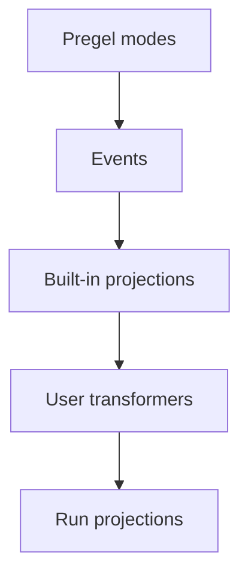

# 事件 streaming（Event Streaming）速读笔记

> 源文件: `src/oss/langgraph/event-streaming.mdx`
> 主题: 面向应用代码推荐的进程内 streaming 模型——在单一底层事件流上暴露**类型化投影**。

## 0. 定位

- 事件 streaming 是**大多数 LangGraph 应用代码推荐的**进程内 streaming 模型。
- 返回一个 **run stream 对象**，可同时以多种方式消费。
- 入口：`graph.stream_events(input, version="v3")`（async 为 `await graph.astream_events(input, version="v3")`）。
- 与 `streaming`（stream-mode API）的关系：事件 streaming **位于其上一层**。需要底层 `stream_mode` 原始事件时用 `streaming`；应用代码能从类型化投影受益时用事件 streaming。
- 部署在 Agent Server 之后的 graph → 用 LangSmith Streaming API。

## 1. 快速开始

```python
stream = graph.stream_events(
    {"messages": [{"role": "user", "content": "What is 42 * 17?"}]},
    version="v3",
)

for message in stream.messages:
    for token in message.text:
        print(token, end="", flush=True)

final_state = stream.output
```

核心心智：**一个 run stream，多种投影**；读 `stream.messages` 不会消耗 `stream.values` / `stream.subgraphs` / `stream.output` 所需的事件，多个消费者可并发读取。

## 2. 各部分如何配合（两层架构）

streaming 栈有两层：

1. **streaming**：从 Pregel 引擎发出**原始 graph 执行事件**（`updates`、`values`、`messages`、`custom`、`checkpoints`、`tasks`、`debug`）。
2. **事件 streaming**：把这些事件规范化，让它们流经 **stream transformers**，并暴露**类型化投影**。

数据流：

```text
Pregel 引擎（运行 graph 步骤）
   │ 发出
原始 Pregel 事件
   │ 发送至
事件路由器（让每个事件流经 transformer 流水线）
   │ 级联穿过
stream transformers（ValuesTransformer / MessagesTransformer / ... / 自定义 transformer）
   │ 产出
事件 stream（为应用代码投影出的事件）
```

- **事件路由器**是两层之间的桥梁：接收规范化后的 Pregel 事件，让每个事件流经已注册的 transformers。
- 内置 transformer 创建标准投影：`stream.messages`、`stream.values`、`stream.subgraphs`、`stream.output`。
- 自定义 transformer 在 `stream.extensions` 下添加应用专属投影。

## 3. 事件 streaming 提供什么（投影表）

| 投影 | 用途 |
| ---- | ---- |
| `stream` | 迭代每一个协议事件（原始）。 |
| `stream.messages` | Stream chat model 消息与 token 增量。 |
| `stream.values` | 迭代 state snapshot 并等待最终值。 |
| `stream.output` | 等待最终输出。 |
| `stream.subgraphs` | 发现并观察嵌套的 graph 执行。 |
| `stream.interrupts` | 检查 human-in-the-loop interrupt payload。 |
| `stream.interrupted` | 检查该 run 是否因等待人工输入而暂停。 |
| `stream.extensions` | 消费自定义 stream transformer 投影。 |

> 多个消费者可并发读取，互不消耗对方的事件。

## 4. Stream 消息（`stream.messages`）

```python
stream = graph.stream_events(input, version="v3")

for message in stream.messages:
    text = str(message.text)          # 完整文本
    usage = message.output.usage_metadata
    print(text)
    print(usage)
```

- 同步代码中 `message.text` **可迭代**：逐 token 迭代它，或 `str(message.text)` 取完整文本。
- `message.reasoning` 暴露 reasoning 增量；`message.tool_calls` 暴露 tool-call 参数块。
- 需要按**精确到达顺序**同时拿 text / reasoning / tool-call 块时：迭代该消息 stream 的**原始事件**，不要分别迭代各投影。

## 5. Stream subgraph（`stream.subgraphs`）

无需解析 namespace 字符串即可观察嵌套 graph 工作：

```python
stream = graph.stream_events(input, version="v3")

for subgraph in stream.subgraphs:
    print(subgraph.graph_name, subgraph.path)
    for message in subgraph.messages:
        print(message.text)
```

- `subgraph.graph_name` 是已编译 graph / agent 的 `name`。
- 从 tool 中派发的具名 agent（如 Deep Agents 的 `task` tool 调用的 `create_agent(name=...)`）会以该名称出现；开启该 scope 的 `lifecycle` 事件会携带 `cause`，指回发起派发的 tool call。
- 产品专属文档：Deep Agents 的 subagent stream、LangChain agent 的 tool call / middleware 事件。

## 6. Stream state（`stream.values`）

每一步之后 stream 完整 state snapshot：

```python
stream = graph.stream_events(input, version="v3")

for snapshot in stream.values:
    print(snapshot)

final_state = stream.output
```

## 7. Stream 多个投影（并发消费）

### async：`astream_events` + `asyncio.gather`

```python
import asyncio

stream = await graph.astream_events(input, version="v3")

async def consume_messages():
    async for message in stream.messages:
        print(f"[llm] node={message.node}")

async def consume_subgraphs():
    async for subgraph in stream.subgraphs:
        print(f"[subgraph] path={subgraph.path}")

await asyncio.gather(consume_messages(), consume_subgraphs())
```

### 同步：`stream.interleave(...)`（按严格到达顺序）

```python
for name, item in stream.interleave("values", "messages", "subgraphs"):
    if name == "values":
        print(f"[state] keys={list(item)}")
    elif name == "messages":
        print(f"[llm] node={item.node}")
    elif name == "subgraphs":
        print(f"[subgraph] path={item.path}")
```

心智模型：**投影之间相互独立**（并发消费 / `interleave`），因此不必在单个循环里按类型分支。

## 8. 在 interrupt 之后恢复

graph 因等待人工输入而暂停时，检查 `stream.interrupted` / `stream.interrupts`，再用 `Command` 恢复。

恢复要求：graph 用 **checkpointer** 编译，且 config 携带 **thread ID**（见 persistence）。

```python
from langgraph.types import Command

stream = graph.stream_events(input, version="v3")

for message in stream.messages:
    print(message.text)

if stream.interrupted:
    print(stream.interrupts)

stream = graph.stream_events(
    Command(resume={"decisions": [{"type": "approve"}]}),
    version="v3",
)
final_state = stream.output
```

## 9. Stream 所有协议事件（原始）

需要原始协议事件流时，直接迭代 run 对象本身：

```python
stream = graph.stream_events({"messages": [{"role": "user", "content": "What is 42 * 17?"}]},
                             version="v3")

for event in stream:
    namespace = event["params"]["namespace"]
    print(namespace, event["method"], event["params"]["data"])
```

`ProtocolEvent` 结构：

```python
class ProtocolEvent(TypedDict):
    seq: int                    # run 内严格递增；用于排序
    method: str                 # 通道名: "messages" / "values" / "updates" / "custom" / "tools" / "lifecycle" / ...
    params: ProtocolEventParams

class ProtocolEventParams(TypedDict):
    namespace: list[str]        # 从根 graph 到该 scope 的 "<name>:<runtime_id>" 路径；[] 表示根
    timestamp: int              # 墙钟毫秒；可能漂移，排序别依赖它
    data: Any                   # 通道相关 payload；形状取决于 method
```

命名空间要点：

- 根是空数组 `[]`。
- 每个子执行添加一个 `"name:runtime_id"` 段，如嵌套 tool call：`["researcher:6f4d", "tools:91ac"]`。
- `:` 之前是稳定的 graph / node 名称；后缀是每次调用的 runtime ID。
- 只关心某子树时，自行按 namespace 过滤原始事件；`stream.subgraphs` 已替你处理嵌套 graph 执行。

## 10. 通道与事件生命周期

原始事件在**通道**上流动，通道名即事件的 `method`：

| 通道 | 用途 |
| ---- | ---- |
| `values` | 完整 graph state snapshot。 |
| `updates` | 每个 node 的 state 增量。 |
| `messages` | 以 content block 为中心的 chat model 输出。 |
| `tools` | tool call 的启动、stream 输出、完成、错误事件。 |
| `lifecycle` | run、subgraph、subagent 的状态变化。 |
| `checkpoints` | 用于分支与 time travel 的轻量 checkpoint 封装。 |
| `input` | human-in-the-loop 的输入请求与响应。 |
| `tasks` | Pregel task 的创建与结果事件。 |
| `custom` | 来自 graph 代码的用户自定义 payload。 |
| `custom:<name>` | 应用自定义的 stream transformer 输出。 |

### 10.1 `messages` 通道（content block 模型）

数据的 `event` 字段取值：

- `message-start`
- `content-block-start`
- `content-block-delta`
- `content-block-finish`
- `message-finish`

要点：

- content block 有明确边界：开始 → 零或多个增量 → 结束，然后下一个块开始。
- 让 token streaming、reasoning 块、tool-call 块、多模态内容都成为显式结构，不依赖 provider 专属格式。
- `message-finish` 可能含 token 用量；不可恢复的 model 调用失败以消息错误事件到达。

直接消费原始 content-block 事件（不用 `stream.messages` 投影）：

```python
for event in stream:
    if event["method"] != "messages":
        continue
    data = event["params"]["data"][0]
    if not isinstance(data, dict):
        continue
    if data.get("event") != "content-block-delta":
        continue
    block = data.get("delta") or {}
    if block.get("type") == "text-delta":
        print(block.get("text", ""), end="", flush=True)
    elif block.get("type") == "reasoning-delta":
        print(f"[thinking]{block.get('reasoning', '')}", end="", flush=True)
```

### 10.2 `tools` 通道

`event` 取值：`tool-started`、`tool-output-delta`、`tool-finished`、`tool-error`。

tool 事件通过 **tool call ID** 关联，可回连到 `messages` 通道上发起它的 tool-call content block。

### 10.3 `lifecycle` 通道

`event` 取值：`started`、`running`、`completed`、`failed`、`interrupted`。

除 `event` 外还可能含可选的 `graph_name`、`error`、`cause`（描述子 scope 为何启动：父 tool call / 扇出 send / edge 转移）。

## 11. 构建你自己的投影（自定义 transformer）

- **stream transformer** 是投影层：观察协议事件、维护自身 state、暴露 run 的派生视图（tool 活动、token 总数、进度、artifact 等）。
- `StreamChannel` 是 transformer 用来发布视图的投影原语。
- 内置投影（`stream.messages` / `stream.values` / `stream.subgraphs` / `stream.output`）与产品专属投影（LangChain 的 `stream.tool_calls`、Deep Agents 的 `stream.subagents`）都是用同一套 contract 实现的 transformer。
- 用户 transformer 通过编译时或调用时注册叠加其上，投影出现在 `stream.extensions` 下。

### 11.1 transformer 如何工作



stream 处理器是中心分发器，对每个协议事件：

1. 按顺序调用每个已注册 transformer 的 `process(event)` 钩子。
2. 把具名 `StreamChannel` 的 push 接回协议事件 stream。
3. 把事件存入 run stream，除非某 transformer 抑制它。
4. run 结束时对每个 transformer 调用 `finalize()` 或 `fail()`。

transformer 是**观察式**的：不回调 graph runtime，只消费事件并把派生值 push 进 `StreamChannel` / promise / 其他投影对象。

### 11.2 transformer 形态（接口）

```python
from langgraph.stream import ProtocolEvent, StreamTransformer

class MyTransformer(StreamTransformer):
    def init(self) -> dict: ...                 # 创建投影对象
    def process(self, event: ProtocolEvent) -> bool: ...  # 观察每个事件；返回 False 抑制原始事件
    def finalize(self) -> None: ...             # stream 成功结束后关闭/resolve 非通道投影
    def fail(self, err: BaseException) -> None: ...       # 把错误传播给非通道投影
```

### 11.3 声明所需的 stream mode（关键）

- `required_stream_modes` 控制底层 graph 在 stream 期间发出哪些 Pregel mode。
- runtime 取所有 transformer 的 `required_stream_modes` 的**并集**，作为 `stream_mode` 传给 graph 的 `.stream()`。
- **没有被任何 transformer 请求的 mode 永远不会被发出**——声明 `("custom",)` 正是让 `custom` 事件在整个 run 中流动的原因。
- `process()` 接收所有已发出的事件，**需自行按 `event["method"]` 过滤**；声明只负责「开启上游发出」，不负责收窄 `process()` 看到的内容。
- 有效值：`messages` / `tools` / `custom` / `values` / `updates` / `checkpoints` / `tasks` / `debug`；每个 transformer 必须声明它要处理的**每一个** mode。

```python
class CustomTransformer(StreamTransformer):
    required_stream_modes = ("custom",)

    def process(self, event: ProtocolEvent) -> bool:
        if event["method"] == "custom":
            ...
        return True
```

### 11.4 StreamChannel

`StreamChannel` 总是在 `stream.extensions.<name>` 上暴露一个可迭代 stream；构造参数决定每次 `push()` 是否也作为 `custom:<name>` 事件流入主事件 stream。

| 需求 | Python 用法 |
| ---- | ---- |
| 仅侧信道投影 | `StreamChannel()` |
| 每次 push 也流入主事件 stream | `StreamChannel(name)` |

- 具名通道的 payload **必须可序列化**（因为每个 push 会变成主 stream 中的 `custom:<name>` 事件）。
- promise、async 可迭代对象、类实例等进程内句柄应放在**匿名通道**中。
- 通道生命周期由 stream 处理器负责：`init()` 返回通道后，run 结束时处理器会关闭 / 使其失败；transformer 只负责 push。

### 11.5 示例：具名通道（ToolActivityTransformer）

```python
from typing import TypedDict
from langgraph.stream import ProtocolEvent, StreamChannel, StreamTransformer

class ToolActivity(TypedDict):
    name: str
    status: str

class ToolActivityTransformer(StreamTransformer):
    required_stream_modes = ("tools",)

    def __init__(self, scope: tuple[str, ...] = ()) -> None:
        super().__init__(scope)
        self.activity = StreamChannel[ToolActivity]("tool_activity")

    def init(self) -> dict:
        return {"tool_activity": self.activity}

    def process(self, event: ProtocolEvent) -> bool:
        if event["method"] != "tools":
            return True
        data = event["params"]["data"]
        if isinstance(data, dict) and data.get("tool_name") and data.get("event"):
            status = "error" if data["event"] == "tool-error" else "started"
            self.activity.push({"name": data["tool_name"], "status": status})
        return True
```

### 11.6 示例：匿名通道（汲取 custom 事件）

不传名称 → 仅侧信道投影（可在 `stream.extensions` 访问，但对迭代原始事件的消费者不可见）；持有不可序列化句柄时用它。

```python
from langgraph.config import get_stream_writer
from langgraph.stream import ProtocolEvent, StreamChannel, StreamTransformer

def node(state):
    writer = get_stream_writer()
    writer({"kind": "progress", "message": "retrieving context"})
    return state

class CustomTransformer(StreamTransformer):
    required_stream_modes = ("custom",)

    def __init__(self, scope: tuple[str, ...] = ()) -> None:
        super().__init__(scope)
        self.log = StreamChannel()

    def init(self) -> dict:
        return {"custom": self.log}

    def process(self, event: ProtocolEvent) -> bool:
        if event["method"] == "custom":
            self.log.push(event["params"]["data"])
        return True

stream = graph.stream_events(input, version="v3", transformers=[CustomTransformer])
for item in stream.extensions["custom"]:
    print(item)
```

### 11.7 示例：最终值投影（StatsTransformer）

统计总 token，在 `finalize()` 时 push：

```python
class StatsTransformer(StreamTransformer):
    required_stream_modes = ("messages",)

    def __init__(self, scope: tuple[str, ...] = ()) -> None:
        super().__init__(scope)
        self.total_tokens = 0
        self.total_tokens_log = StreamChannel[int]()

    def init(self) -> dict:
        return {"total_tokens": self.total_tokens_log}

    def process(self, event: ProtocolEvent) -> bool:
        data = event["params"]["data"]
        if isinstance(data, dict):
            usage = data.get("usage") or {}
            self.total_tokens += usage.get("output_tokens") or 0
        return True

    def finalize(self) -> None:
        self.total_tokens_log.push(self.total_tokens)
        self.total_tokens_log.close()
```

### 11.8 注册方式

- **调用时**（本地试验）：

```python
stream = graph.stream_events(input, version="v3",
                             transformers=[StatsTransformer, ToolActivityTransformer])
```

- **编译时**（该 graph 的每次 run 都产出该投影）：

```python
graph = builder.compile(transformers=[StatsTransformer, ToolActivityTransformer])
```

### 11.9 内置 `ToolCallTransformer`

注册它即可在普通 `StateGraph` 上暴露 `stream.tool_calls`：

```python
from langgraph.prebuilt import ToolCallTransformer

stream = graph.stream_events(input, version="v3", transformers=[ToolCallTransformer])

for tool_call in stream.tool_calls:
    print(tool_call.tool_name, tool_call.input)
```

## 12. 易错点 / 坑 / 概念区分

1. **事件 streaming vs stream-mode API**：前者是「类型化投影」的上层封装（推荐用于应用代码）；后者是底层原始 `stream_mode` 事件。别在事件 streaming 里再去找 `chunk["type"]`，投影是分开的迭代器。
2. **投影相互独立可并发**：读 `stream.messages` 不会消耗 `stream.values`/`output` 的事件；同步下若要按到达顺序混合，用 `stream.interleave(...)`，async 下用 `asyncio.gather`。
3. **`stream.output` 不是「边跑边出」**：它是**等待最终值**的投影；要逐步快照用 `stream.values`。
4. **`message.text` 的双重角色**：同步下可迭代（逐 token）也可 `str()` 取全文；async 下既是 async 可迭代也类 promise（可 `await`）。别混用。
5. **顺序敏感时迭代原始事件**：需要 text / reasoning / tool-call 的精确交错顺序时，别分别迭代各投影。
6. **`required_stream_modes` 是「开关」不是「过滤器」**：未声明的 mode 根本不会被 graph 发出；`process()` 收到的是所有已发出事件，仍要按 `event["method"]` 自行过滤。
7. **具名通道的 payload 必须可序列化**：因为它同时会作为 `custom:<name>` 进入主事件 stream；不可序列化的句柄放匿名通道。
8. **`seq` 用于排序，`timestamp` 不可靠**：`timestamp` 是墙钟毫秒，可能漂移。
9. **namespace 解析**：根为 `[]`，子执行追加 `"name:runtime_id"`；需要整棵子树时用 `stream.subgraphs` 而非手动字符串匹配。
10. **interrupt 恢复需要 checkpointer + thread ID**，并用 `Command(resume=...)` 再次调用 `stream_events(..., version="v3")`。

## 13. 一句话心智模型

> **Pregel 发原始事件 → 事件路由器让它们流经 transformers → 给你一个 run stream，上面挂着多个互不干扰的类型化投影**；投影不够用时，写一个 transformer 把派生视图 push 进 `StreamChannel`，它会出现在 `stream.extensions` 下。
