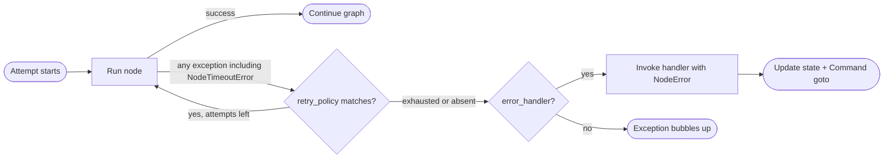

# 容错（Fault Tolerance）速读笔记

> 源文件: `src/oss/langgraph/fault-tolerance.mdx`
> 主题: 在 LangGraph 中配置 node 级的**超时、重试、错误处理**，以及 graph 默认值与优雅关闭。

## 0. 总览：三种可组合机制

当某个 node 失败（外部 API 慢、瞬时网络错误、未处理异常），LangGraph 提供三种可组合机制：

- **重试（Retries）**：根据异常类型与退避设置自动重新运行失败的尝试。
- **超时（Timeouts）**：限制单次尝试能运行多久。
- **错误处理（Error Handling）**：在所有重试耗尽之后运行一个恢复函数。

**固定组合顺序**：node 尝试抛出任何异常（**包括超时产生的 `NodeTimeoutError`**）→ 重试策略决定是否重试 → 只有**重试耗尽之后** error handler 才运行。



> 一句话：**重试决定要不要再试，超时决定单次能跑多久，error handler 决定彻底失败后怎么收场。**

版本要求：

- Python：node 级超时与 node 级 error handler 需要 `langgraph>=1.2`。
- JS：需要 `@langchain/langgraph>=1.4.0`。

## 1. 重试（RetryPolicy）

把 `retry_policy=` 传给 `add_node`：

```python
from langgraph.types import RetryPolicy

builder.add_node(
    "call_api",
    call_api,
    retry_policy=RetryPolicy(max_attempts=3),
)
```

### 1.1 默认行为（Python）

- `retry_on` 默认使用 `default_retry_on`：对**任何**异常重试，**除了**以下异常及其子类：
  - `ValueError`、`TypeError`、`ArithmeticError`、`ImportError`、`LookupError`、`NameError`、`SyntaxError`、`RuntimeError`、`ReferenceError`、`StopIteration`、`StopAsyncIteration`、`OSError`。
- 对 `requests`、`httpx` 等 HTTP 库的异常：**只对 5xx 状态码重试**。
- `NodeTimeoutError` 默认即可重试。

> JS 侧重试**必须显式开启**：只有配置了 `retryPolicy`（直接传或经 `setNodeDefaults`）才会重试，空策略 `{}` 即可；没有策略则第一次失败就结束，且不会调用 `retryOn`。内置排除项包括 AbortError / Cancel、`GraphValueError`、`ECONNABORTED`、部分 4xx（400/401/402/403/404/405/406/407/409）、OpenAI 配额错误等；408 与 5xx 可重试。

### 1.2 参数

Python：

| 参数 | 类型 | 默认值 | 说明 |
| ---- | ---- | ---- | ---- |
| `max_attempts` | `int` | `3` | 最大尝试次数（含第一次）。 |
| `initial_interval` | `float` | `0.5` | 第一次重试前等待的秒数。 |
| `backoff_factor` | `float` | `2.0` | 每次重试后施加到间隔上的倍数。 |
| `max_interval` | `float` | `128.0` | 两次重试之间的最大秒数。 |
| `jitter` | `bool` | `True` | 为间隔添加随机抖动。 |
| `retry_on` | 异常类型 / 序列 / 可调用 | `default_retry_on` | 要重试的异常，或返回 `True` 判定可重试的可调用对象。 |

JS 对应为 `maxAttempts`（默认 3）、`initialInterval`（500ms）、`backoffFactor`（2.0）、`maxInterval`（128000ms）、`jitter`（true）、`retryOn`、`logWarning`（true）。

### 1.3 自定义重试逻辑

传入可调用对象或异常类型；可导入 `default_retry_on` 扩展默认行为：

```python
from langgraph.types import RetryPolicy, default_retry_on

def custom_retry_on(exc: BaseException) -> bool:
    if isinstance(exc, MyCustomError):
        return False
    return default_retry_on(exc)

builder.add_node(
    "call_api", call_api,
    retry_policy=RetryPolicy(max_attempts=3, retry_on=custom_retry_on),
)
```

> JS 没有导出的 `defaultRetryOn` 辅助函数，需自己实现判断函数。

### 1.4 查看重试 state（execution_info）

在 node 内用 `runtime.execution_info` 查看当前尝试次数——适合「主调用持续失败就切回退方案」：

```python
from langgraph.runtime import Runtime
from langgraph.types import RetryPolicy

def my_node(state, runtime: Runtime):
    if runtime.execution_info.node_attempt > 1:   # 从 1 开始计数
        return {"result": call_fallback_api()}
    return {"result": call_primary_api()}

builder.add_node("my_node", my_node, retry_policy=RetryPolicy(max_attempts=3))
```

`execution_info` 字段：

| 属性 | 类型 | 说明 |
| ---- | ---- | ---- |
| `node_attempt` | `int` | 当前尝试次数（从 1 开始）。 |
| `node_first_attempt_time` | `float \| None` | 第一次尝试开始的 Unix 时间戳，多次重试间保持不变。 |
| `thread_id` | `str \| None` | 当前 Thread ID；无 checkpointer 时为 `None`。 |
| `run_id` | `str \| None` | 当前 Run ID；config 未提供时为 `None`。 |
| `checkpoint_id` | `str` | 当前 Checkpoint ID。 |
| `task_id` | `str` | 当前 Task ID。 |

> 即使没有重试策略也可用 `execution_info`，`node_attempt` 默认为 `1`。

## 2. 超时（TimeoutPolicy）

`add_node` 的 `timeout=` 限制单次 node 尝试的最长运行时长：

```python
from datetime import timedelta
from langgraph.types import TimeoutPolicy

builder.add_node("call_model", call_model, timeout=60)                 # 60 秒
builder.add_node("call_model", call_model, timeout=timedelta(minutes=2))
builder.add_node("call_model", call_model,
                 timeout=TimeoutPolicy(run_timeout=120, idle_timeout=30))
```

**重要坑**：node 超时**只对 async node 生效**。带 `timeout` 的同步 node 会在**编译时被拒绝**。要包装阻塞式 I/O，请在 async node 内用 `asyncio.to_thread`。

### 2.1 运行超时（run_timeout）

- 对单次尝试的**硬性墙钟上限**。
- **不会**因 node 有活动而被刷新。
- 超过上限 → 抛 `NodeTimeoutError`、**清除该失败尝试产生的任何写入**、交给重试策略决定是否重试。

```python
builder.add_node("call_model", call_model, timeout=TimeoutPolicy(run_timeout=120))
```

### 2.2 空闲超时（idle_timeout）

- 一种**随进度重置**的上限。
- 仅当 node 在指定时长内**不再产生可观测进度**时才触发。
- 与 `run_timeout` 不同：只要有进度信号，计时就重置。

```python
builder.add_node("call_model", call_model, timeout=TimeoutPolicy(idle_timeout=30))
```

可同时设置 `run_timeout` 与 `idle_timeout`，**先触发者**取消该次尝试。

### 2.3 进度信号（refresh_on="auto" 默认）

空闲计时会在以下任一情况重置：

- 通过 `CONFIG_KEY_SEND` 的 state 写入。
- stream 输出（yield 出的 async stream 分块）。
- 子任务调度。
- runtime 的 stream-writer 调用。
- 来自该 node 或其下级的任何 LangChain 回调事件（LLM token、tool 调用、chain start/end 等）。

### 2.4 心跳模式（refresh_on="heartbeat"）

把刷新来源收窄为**仅显式调用 `runtime.heartbeat()`**，适合需要严格空闲定义、不想被话多下级组件重置的场景：

```python
from langgraph.types import TimeoutPolicy

builder.add_node("call_model", call_model,
                 timeout=TimeoutPolicy(idle_timeout=30, refresh_on="heartbeat"))
```

### 2.5 手动心跳

长时间运行、不自然产生进度信号的任务，手动重置空闲计时：

```python
async def long_running_node(state, runtime: Runtime):
    for batch in fetch_batches():
        process(batch)
        runtime.heartbeat()   # 手动重置空闲计时
    return {"result": "done"}

builder.add_node("long_running_node", long_running_node,
                 timeout=TimeoutPolicy(idle_timeout=30, refresh_on="heartbeat"))
```

> `runtime.heartbeat()` 在未启用空闲计时的尝试中是**空操作**，可无条件调用。

### 2.6 NodeTimeoutError

超时触发时抛出，带结构化上下文：

| 属性 | 类型 | 说明 |
| ---- | ---- | ---- |
| `node` | `str` | 超时的 node 名。 |
| `elapsed` | `float` | 触发前经过的秒数。 |
| `kind` | `Literal["idle", "run"]` | 触发的是哪种超时。 |
| `idle_timeout` | `float \| None` | 已配置的空闲超时（秒）。 |
| `run_timeout` | `float \| None` | 已配置的运行超时（秒）。 |

> JS 中可用 `isNodeTimeoutError(error)` 收窄错误类型。

`NodeTimeoutError` **默认即可重试**；与重试组合开箱即用：每次新尝试重置超时计时，超时尝试的写入会在下次重试前被清除。

```python
builder.add_node("call_model", call_model,
                 timeout=TimeoutPolicy(idle_timeout=30),
                 retry_policy=RetryPolicy(max_attempts=3))
```

### 2.7 用 Send 实现动态超时

用 `Send` 动态派发 node（如 map-reduce）时，可在 `Send` 上传超时，覆盖目标 node 的静态超时：

```python
from langgraph.types import Send, TimeoutPolicy

def fan_out(state):
    return [
        Send("process_item", {"item": item}, timeout=TimeoutPolicy(idle_timeout=15))
        for item in state["items"]
    ]
```

> 若 `Send` 上省略超时，则用目标 node 在 `add_node` 时设置的超时——可给 node 设默认值，再针对单次调用收紧。

## 3. 错误处理（error_handler）

- error handler 在 node 失败且**所有重试耗尽之后**运行。
- 接收当前 state，可更新它，也可用 `Command` 路由到另一个 node。
- 适合补偿流程（**Saga 模式**）：优雅恢复而非中止整个 graph。

```python
from langgraph.errors import NodeError
from langgraph.types import Command, RetryPolicy

def payment_error_handler(state, error: NodeError) -> Command:
    return Command(
        update={"status": f"compensated: {error.error}"},
        goto="finalize",
    )

graph = (
    StateGraph(State)
    .add_node("charge_payment", charge_payment,
              retry_policy=RetryPolicy(max_attempts=3, retry_on=ConnectionError),
              error_handler=payment_error_handler)
    .add_node("finalize", finalize)
    .add_edge(START, "charge_payment")
    .compile()
)
```

> **重试策略与 error handler 解耦**：你可以独立配置「何时重试」与「何时补偿」。若没配置重试策略，handler 会在第一次失败时立即触发。

### 3.1 NodeError

error handler 通过类型注解注入 `error: NodeError`（与 `runtime: Runtime` 的模式相同）：

```python
def my_handler(state, error: NodeError) -> Command:
    print(f"Node {error.node} failed with: {error.error}")
    return Command(update={"status": "recovered"}, goto="next_step")
```

frozen dataclass / 类，两个字段：

| 属性 | 类型 | 说明 |
| ---- | ---- | ---- |
| `node` | `str` | 失败的 node 名。 |
| `error` | `BaseException` | 该 node 抛出的异常。 |

`error: NodeError` 参数是**可选加入**的：不需要失败上下文的 handler 可用 `(state)` 或 `(state, runtime)` 等更简签名。

### 3.2 用 Command 路由（Saga / 补偿）

```python
def payment_error_handler(state, error: NodeError) -> Command:
    return Command(
        update={"status": f"compensated_after_{error.node}: {error.error}"},
        goto="finalize",
    )
```

`charge_payment` 对 `ConnectionError` 重试最多 3 次；重试耗尽（或错误不是 `ConnectionError`）时，handler 通过更新 state 并路由到 `finalize` 来补偿，而不是中止 graph。

### 3.3 可安全恢复的失败

**失败的来源信息会被 checkpoint 记录**：如果 graph 在 node 失败后、handler 完成前被 interrupt，或进程在此期间崩溃，那么当 graph 从自己的 checkpoint 恢复时，handler 仍会看到相同的 `NodeError` 上下文。

### 3.4 与 `interrupt()` 一起使用

**坑**：node 内抛出的 `interrupt()` **不会**被路由到 error handler。interrupt 使用 `GraphBubbleUp` 机制为 human-in-the-loop 暂停图执行，因此会**绕过重试策略与 error handler 两者**；graph 照常暂停。

### 3.5 Subgraph 失败

若 node 包装了 subgraph 且该 subgraph 抛出未处理异常，异常会传到父 node。若父 node 配了 error handler，handler 会触发，并把 subgraph 的异常放在 `error.error` 中。

## 4. Graph 默认值（set_node_defaults / setNodeDefaults）

用 `set_node_defaults` 一次配置整个 graph 的 `retry_policy` / `error_handler` / `timeout` / `cache_policy` 默认值，避免每次 `add_node` 重复：

```python
graph = (
    StateGraph(State)
    .set_node_defaults(
        retry_policy=RetryPolicy(max_attempts=3),
        error_handler=default_error_handler,
        timeout=TimeoutPolicy(run_timeout=30),
    )
    .add_node("step_a", step_a)
    .add_node("step_b", step_b)
    .add_edge(START, "step_a")
    .compile()
)
```

### 4.1 优先级

- 直接传给 `add_node()` 的 node 级值**总会覆盖** `set_node_defaults()` 的默认值。
- 默认值在 `compile()` 时解析，因此 `set_node_defaults()` 可在 `add_node()` 之前或之后、任意顺序调用。

```python
graph = (
    StateGraph(State)
    .set_node_defaults(error_handler=default_error_handler)
    .add_node("step_a", step_a)                                      # 用默认 handler
    .add_node("step_b", step_b, error_handler=custom_error_handler)  # 用自定义
    .compile()
)
```

### 4.2 默认 error handler 的典型场景

每次 graph run 对应一个外部流程（如后台任务表的一行），任何未处理的 node 失败都应把该流程标记为失败——此时默认 `error_handler` 特别有价值；个别步骤需要自己逻辑时，node 级 handler 仍优先。

handler 可接受可选的第三个参数 `RunnableConfig`（用于取 `thread_id` 等 config 值）：

```python
from langchain_core.runnables import RunnableConfig

def mark_process_failed(state, error: NodeError, config: RunnableConfig):
    thread_id = config["configurable"].get("thread_id")
    return {"status": f"failed on thread {thread_id}: {error.error}"}
```

### 4.3 适用性矩阵（重要）

error-handler node（通过 `add_node(error_handler=...)` 注册的 node）被排除在某些默认值之外，以避免不安全行为：

| `set_node_defaults` 参数 | 适用于普通 node | 适用于 error-handler node | 原因 |
| ---- | ---- | ---- | ---- |
| `retry_policy` | 是 | 是 | handler 在瞬时故障时应被重试。 |
| `timeout` | 是 | 是 | 卡住的 handler 应像普通 node 一样被取消。 |
| `error_handler` | 是 | **否** | handler 绝不能捕获自己。 |
| `cache_policy` | 是 | **否** | 缓存 handler 的结果不安全。 |

### 4.4 作用域

**父 graph 的默认值不会被子 subgraph 继承**；每个 graph 各自维护自己的默认值。

## 5. Functional API

`@task` 与 `@entrypoint` 支持相同的 `timeout=` 与 `retry_policy=`：

```python
from langgraph.func import entrypoint, task
from langgraph.types import RetryPolicy, TimeoutPolicy

@task(
    timeout=TimeoutPolicy(idle_timeout=30),
    retry_policy=RetryPolicy(max_attempts=3),
)
async def call_api(url: str) -> str:
    response = await fetch(url)
    return response.text

@entrypoint(timeout=60)
async def my_workflow(inputs: dict) -> str:
    return await call_api("https://api.example.com/data")
```

行为与 `add_node` 完全一致：超时抛 `NodeTimeoutError`、缓冲写入被清除、重试策略决定是否重试。

> JS 侧 `task` 的对应选项名是 `retry`（不是 `retryPolicy`）；且 `task` / `entrypoint` **不支持 error handler**，error handler 仅限 `StateGraph.addNode`。

## 6. 优雅关闭（Graceful Shutdown）

协作式关闭：在当前 **superstep 完成之后**停止一次正在运行的 graph，并保存**可恢复的 checkpoint**。适合处理 SIGTERM 或外部 supervisor 回收资源。

创建一个 `RunControl`，以 `control=` 传给 `invoke` / `stream`；可从任意 thread 调用 `request_drain()`：

```python
from langgraph.runtime import RunControl
from langgraph.errors import GraphDrained

control = RunControl()
# 在信号处理器或 supervisor 中：
# control.request_drain("sigterm")

try:
    result = graph.invoke(inputs, config, control=control)
except GraphDrained as e:
    # graph 提前停止并保存了 checkpoint，稍后用相同 config 恢复
    print(f"Drained: {e.reason}")
```

### 6.1 语义（关键：协作式、只在 superstep 之间生效）

| 场景 | 行为 |
| ---- | ---- |
| Node 执行到一半 | 运行至完成；排空在**下一个 superstep** 生效。 |
| 带重试策略且正在重试的 Node | 重试循环运行到耗尽或成功；排空在其后生效。 |
| Graph 与排空在同一次 tick 自然结束 | 正常返回；检查 `control.drain_requested` 区分于普通运行。 |
| 还有更多 superstep 剩余 | 抛 `GraphDrained(reason)`；checkpoint 被保存且可恢复。 |
| Subgraph 请求排空 | `GraphDrained` 经父级向上抛，并在父级自己的下一个 superstep 边界停止它。 |

**要点**：排空**绝不抢占**已经在运行的工作。

### 6.2 排空后恢复

用相同 `thread_id`、以 `invoke(None, config)` 恢复：

```python
result = graph.invoke(None, config)
```

### 6.3 在 node 内读取排空 state

通过 `runtime` 参数提前感知并调整行为：

```python
async def my_node(state, runtime: Runtime):
    if runtime.drain_requested:
        return {"status": "skipped", "reason": runtime.drain_reason}
    return {"status": await do_work()}
```

### 6.4 SIGTERM 钩子模式（推荐）

```python
import signal
from langgraph.runtime import RunControl
from langgraph.errors import GraphDrained

control = RunControl()
signal.signal(signal.SIGTERM, lambda *_: control.request_drain("sigterm"))

try:
    result = graph.invoke(inputs, config, control=control)
except GraphDrained as e:
    log.info("graph drained: %s", e.reason)
    # 下次启动用相同 config 恢复
```

**坑**：`request_drain()` **不会**取消正在运行的 asyncio 任务，也**不会**终止 thread。需要硬性上限时，把排空与优雅超时 + 任务取消配合使用。

## 7. 限制汇总

Python：

- **超时仅支持 async**：带 `timeout` 的同步 node 编译时被拒绝。
- **每个 node 一个 handler**：最多一个 `error_handler`。
- **handler 失败会向上抛**：handler 自身抛异常时，像该 node 没有 handler 一样向上传播。
- **`set_node_defaults` 不被 subgraph 继承**：每个 graph 独立管理。

JS 额外：

- **error handler 仅限 `StateGraph`**：传给 `StateGraph.addNode`，不是基类 `Graph`；`task` / `entrypoint` 不支持。
- **`setNodeDefaults` 不被 subgraph 继承**。
- 每个 node 最多一个 `errorHandler`；handler 失败向上抛。

## 8. 易错点 / 概念区分

1. **组合顺序是固定的**：异常（含 `NodeTimeoutError`）→ 重试 → 重试耗尽后 error handler。别指望 handler 能在重试前运行。
2. **超时只支持 async node**：同步 node + `timeout` 直接编译失败；阻塞 I/O 用 `asyncio.to_thread`。
3. **`run_timeout` vs `idle_timeout`**：前者是硬墙钟上限、不刷新；后者随进度重置。同时设置时先触发者取消尝试。
4. **超时会清除失败尝试的写入**：超时尝试产生的 state 写入会在下次重试前被清掉（`NodeTimeoutError`）。
5. **`interrupt()` 绕过重试与 error handler**：它用 `GraphBubbleUp` 暂停 graph，不会被 handler 捕获。
6. **每个 node 只能有一个 error handler**，且 handler 内部的异常会向上抛（不会被自己捕获）。
7. **默认值的适用范围有限**：`error_handler` 与 `cache_policy` **不**作用于 error-handler node（避免 handler 捕获自己 / 缓存 handler 结果）。
8. **默认值不跨 subgraph 继承**。
9. **JS 侧重试必须显式开启**（需要 `retryPolicy`，空 `{}` 亦可）；Python 侧默认就有 `default_retry_on`。
10. **JS 的 `task` 用 `retry` 选项**（不是 `retryPolicy`），且 functional API 无 error handler。
11. **排空是协作式的**：只在 superstep 之间生效，`request_drain()` 不取消进行中的任务；需要硬上限要配合超时/取消。

## 9. 一句话心智模型

> node 尝试抛异常 → 由**重试策略**（按异常类型 + 退避）决定再试，**超时**给单次尝试设上限（硬墙钟 / 随进度刷新的空闲），全都不行后由 **error handler** 用 `NodeError` 做补偿并 `Command` 路由；`set_node_defaults` 统一设默认，`RunControl` 让长任务在 superstep 边界优雅停下并留下可恢复 checkpoint。
