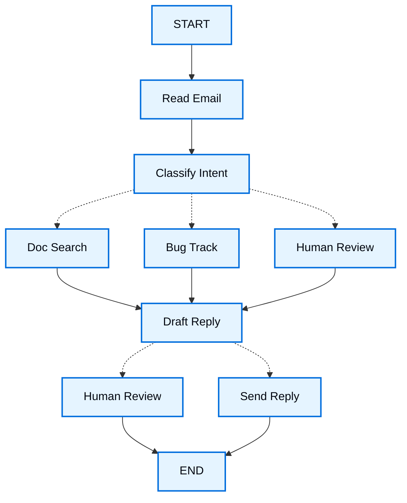

import LanggraphThinkingHitlV2Py from '/snippets/code-samples/langgraph-thinking-hitl-v2-py.mdx';

用 LangGraph 构建 agent 时, 你首先要把它拆分成一个个离散的步骤, 这些步骤称为 **node**。然后, 描述每个 node 可能做出的不同决策与跳转。最后, 通过一个共享的 **state** 把 nodes 连接起来, 每个 node 都可以读写这个 state。

在本篇实战讲解中, 我们会带你走一遍用 LangGraph 构建客服邮件 agent 的思考过程。

## 从你想自动化的流程开始

假设你需要构建一个处理客服邮件的 AI agent。产品团队给了你这些需求:

```txt
该 agent 应当:

- 读取收到的客户邮件
- 按紧急程度与主题进行分类
- 检索相关文档以回答问题
- 起草合适的回复
- 把复杂问题升级给人工 agent
- 在需要时安排后续跟进

需要处理的示例场景:

1. 简单的产品问题: "How do I reset my password?"
2. Bug 报告: "The export feature crashes when I select PDF format"
3. 紧急账单问题: "I was charged twice for my subscription!"
4. 功能请求: "Can you add dark mode to the mobile app?"
5. 复杂技术问题: "Our API integration fails intermittently with 504 errors"
```

在 LangGraph 中实现 agent, 通常遵循相同的五个步骤。

## Step 1: Map out your workflow as discrete steps

先识别流程中彼此独立的步骤。每个步骤都会成为一个 **node**(一个只做一件具体事情的函数)。然后画出这些步骤之间如何连接。



图中的箭头表示可能的路径, 但真正决定走哪条路径的逻辑发生在每个 node 内部。

现在我们已经识别出 workflow 中的各个组成部分, 接下来看看每个 node 需要做什么:

- `Read Email`: 提取并解析邮件内容
- `Classify Intent`: 用 LLM 对紧急程度与主题进行分类, 然后路由到相应操作
- `Doc Search`: 在你的知识库中查询相关信息
- `Bug Track`: 在跟踪系统中创建或更新 issue
- `Draft Reply`: 生成合适的回复
- `Human Review`: 升级给人工 agent 审批或处理
- `Send Reply`: 发送邮件回复

<Tip>
注意, 有些 node 会决定接下来去哪里(`Classify Intent`、`Draft Reply`、`Human Review`), 而另一些 node 总是进入同一个下一步(`Read Email` 总是进入 `Classify Intent`, `Doc Search` 总是进入 `Draft Reply`)。
</Tip>

## Step 2: Identify what each step needs to do

对 graph 中的每个 node, 判断它属于哪类操作, 以及它正常工作需要哪些上下文。

<CardGroup cols={2}>
    <Card title="LLM steps" icon="brain" href="#llm-steps">
        当你需要理解、分析、生成文本或做出推理决策时使用
    </Card>
    <Card title="Data steps" icon="database" href="#data-steps">
        当你需要从外部来源检索信息时使用
    </Card>
    <Card title="Action steps" icon="bolt" href="#action-steps">
        当你需要执行外部操作时使用
    </Card>
    <Card title="User input steps" icon="user" href="#user-input-steps">
        当你需要人工介入时使用
    </Card>
</CardGroup>

### LLM steps

当一个步骤需要理解、分析、生成文本或做出推理决策时:

<AccordionGroup>
    <Accordion title="Classify intent">
        - 静态上下文(prompt): 分类类别、紧急程度定义、响应格式
        - 动态上下文(来自 state): 邮件内容、发件人信息
        - 期望结果: 决定路由的结构化分类结果
    </Accordion>

    <Accordion title="Draft reply">
        - 静态上下文(prompt): 语气准则、公司政策、响应模板
        - 动态上下文(来自 state): 分类结果、搜索结果、客户历史
        - 期望结果: 可供审阅的专业邮件回复
    </Accordion>
</AccordionGroup>

### Data steps

当一个步骤需要从外部来源检索信息时:

<AccordionGroup>
    <Accordion title="Document search">
        - 参数: 由 intent 与 topic 构造的查询
        - 重试策略: 是, 针对瞬时故障采用指数退避
        - 缓存: 可以缓存常见查询, 以减少 API 调用
    </Accordion>

    <Accordion title="Customer history lookup">
        - 参数: 来自 state 的客户邮箱或 ID
        - 重试策略: 是, 但在数据不可用时回退到基本信息
        - 缓存: 是, 设置 time-to-live 以平衡新鲜度与性能
    </Accordion>
</AccordionGroup>

### Action steps

当一个步骤需要执行外部操作时:

<AccordionGroup>
    <Accordion title="Send reply">
        - node 执行时机: 获得批准之后(人工或自动)
        - 重试策略: 是, 针对网络问题采用指数退避
        - 不应缓存: 每次发送都是唯一的操作
    </Accordion>

    <Accordion title="Bug track">
        - node 执行时机: 当 intent 为 "bug" 时总是执行
        - 重试策略: 是, 不能丢失 bug 报告, 这一点至关重要
        - 返回值: 需要包含在回复中的工单 ID
    </Accordion>
</AccordionGroup>

### User input steps

当一个步骤需要人工介入时:

<AccordionGroup>
    <Accordion title="Human review node">
        - 决策所需上下文: 原始邮件、回复草稿、紧急程度、分类结果
        - 期望的输入格式: 审批布尔值, 以及可选的修改后回复
        - 触发时机: 高紧急程度、复杂问题或质量隐患
    </Accordion>
</AccordionGroup>

## Step 3: Design your state

state 是你的 agent 中所有 nodes 都能访问的共享 [memory](/oss/concepts/memory)。可以把它想象成 agent 的笔记本, 用来记录它在处理流程中了解到和决定的一切。

### state 里应该放什么?

对每一条数据, 问自己这些问题:

<CardGroup cols={2}>
    <Card title="放入 state" icon="check">
        它需要跨步骤持续存在吗? 如果是, 就放进 state。
    </Card>

    <Card title="不要存储" icon="code">
        你能从其他数据推导出它吗? 如果可以, 就在需要时计算, 而不是把它存进 state。
    </Card>
</CardGroup>

对于我们的 email agent, 需要跟踪:

- 原始邮件与发件人信息(之后无法重建)
- 分类结果(多个后续/下游 node 都需要)
- 搜索结果与客户数据(重新获取代价高)
- 回复草稿(需要在审阅过程中保留)
- 执行元数据(用于调试与恢复)

### 让 state 保持原始, 按需格式化 prompt

<Tip>
    一条关键原则: state 应存储原始数据, 而不是格式化后的文本。在 node 内部需要用到 prompt 时, 再进行格式化。
</Tip>

这种分离意味着:

- 不同 node 可以根据自身需要, 以不同方式格式化同一份数据
- 你可以修改 prompt 模板, 而无需改动 state schema
- 调试更清晰: 你能准确看到每个 node 收到了什么数据
- agent 可以持续演进, 而不会破坏已有的 state

我们来定义 state:

:::python

```python
from typing import TypedDict, Literal

# Define the structure for email classification
class EmailClassification(TypedDict):
    intent: Literal["question", "bug", "billing", "feature", "complex"]
    urgency: Literal["low", "medium", "high", "critical"]
    topic: str
    summary: str

class EmailAgentState(TypedDict):
    # Raw email data
    email_content: str
    sender_email: str
    email_id: str

    # Classification result
    classification: EmailClassification | None

    # Raw search/API results
    search_results: list[str] | None  # List of raw document chunks
    customer_history: dict | None  # Raw customer data from CRM

    # Generated content
    draft_response: str | None
    messages: list[str] | None
```

:::

:::js

```typescript
import { StateSchema } from "@langchain/langgraph";
import * as z from "zod";

// Define the structure for email classification
const EmailClassificationSchema = z.object({
  intent: z.enum(["question", "bug", "billing", "feature", "complex"]),
  urgency: z.enum(["low", "medium", "high", "critical"]),
  topic: z.string(),
  summary: z.string(),
});

const EmailAgentState = new StateSchema({
  // Raw email data
  emailContent: z.string(),
  senderEmail: z.string(),
  emailId: z.string(),

  // Classification result
  classification: EmailClassificationSchema.optional(),

  // Raw search/API results
  searchResults: z.array(z.string()).optional(),  // List of raw document chunks
  customerHistory: z.record(z.string(), z.any()).optional(),  // Raw customer data from CRM

  // Generated content
  responseText: z.string().optional(),
});

type EmailClassificationType = z.infer<typeof EmailClassificationSchema>;
```

:::


注意, state 中只包含原始数据: 没有 prompt 模板, 没有格式化字符串, 也没有指令。分类输出以一个字典的形式直接来自 LLM, 并原样存入 state。

## Step 4: Build your nodes

:::python

现在我们用函数来实现每个步骤。LangGraph 中的 node 就是一个接收当前 state 并返回 state 更新的 Python 函数。

:::

:::js

现在我们用函数来实现每个步骤。LangGraph 中的 node 就是一个接收当前 state 并返回 state 更新的 JavaScript 函数。

:::

### Handle errors appropriately

不同类型的错误需要不同的处理策略:

| 错误类型 | 谁来修复 | 策略 | 使用场景 |
|------------|--------------|----------|-------------|
| 瞬时错误(网络问题、速率限制) | 系统(自动) | 重试策略 | 通常在重试后就能解决的临时故障 |
| LLM 可恢复的错误(tool 失败、解析问题) | LLM | 把错误存入 state 并回环 | LLM 能看到错误并调整做法 |
| 用户可修复的错误(信息缺失、指令不清) | 人工 | 用 `interrupt()` 暂停 | 需要用户输入才能继续 |
| 重试后仍可恢复的失败 | 开发者(声明式) | `error_handler` | 重试耗尽后运行补偿/恢复分支 |
| 意料之外的错误 | 开发者 | 让其向上抛出 | 需要调试的未知问题 |

<Tabs>
    <Tab title="瞬时错误" icon="rotate">
        添加重试策略, 自动重试网络问题与速率限制。

    :::python

    可与 `timeout=` 配合, 为每次尝试设置上限。完整生命周期请参阅 [容错](/oss/langgraph/fault-tolerance)。

    ```python
    from langgraph.types import RetryPolicy

    workflow.add_node(
        "search_documentation",
        search_documentation,
        retry_policy=RetryPolicy(max_attempts=3, initial_interval=1.0)
    )
    ```

    :::

    :::js

    ```typescript
    import type { RetryPolicy } from "@langchain/langgraph";

    workflow.addNode(
      "searchDocumentation",
      searchDocumentation,
      {
        retryPolicy: { maxAttempts: 3, initialInterval: 1.0 },
      },
    );
    ```

    :::

    </Tab>

    <Tab title="LLM 可恢复" icon="brain">
        把错误存入 state 并回环, 让 LLM 看到问题所在并重试:

    :::python

    ```python
    from langgraph.types import Command


    def execute_tool(state: State) -> Command[Literal["agent", "execute_tool"]]:
        try:
            result = run_tool(state['tool_call'])
            return Command(update={"tool_result": result}, goto="agent")
        except ToolError as e:
            # Let the LLM see what went wrong and try again
            return Command(
                update={"tool_result": f"Tool error: {str(e)}"},
                goto="agent"
            )
    ```

    :::

    :::js

    ```typescript
    import { Command, GraphNode } from "@langchain/langgraph";

    const executeTool: GraphNode<typeof State> = async (state, config) => {
      try {
        const result = await runTool(state.toolCall);
        return new Command({
          update: { toolResult: result },
          goto: "agent",
        });
      } catch (error) {
        // Let the LLM see what went wrong and try again
        return new Command({
          update: { toolResult: `Tool error: ${error}` },
          goto: "agent"
        });
      }
    }
    ```

    :::

    </Tab>

    <Tab title="用户可修复" icon="user">
        在需要时暂停并向用户收集信息(例如账号 ID、订单号或补充说明):

    :::python

    ```python
    from langgraph.types import Command


    def lookup_customer_history(
        state: State
    ) -> Command[Literal["lookup_customer_history", "draft_response"]]:
        if not state.get('customer_id'):
            user_input = interrupt({
                "message": "Customer ID needed",
                "request": "Please provide the customer's account ID to look up their subscription history"
            })
            return Command(
                update={"customer_id": user_input['customer_id']},
                goto="lookup_customer_history"
            )
        # Now proceed with the lookup
        customer_data = fetch_customer_history(state['customer_id'])
        return Command(update={"customer_history": customer_data}, goto="draft_response")
    ```

    :::

    :::js

    ```typescript
    import { Command, GraphNode, interrupt } from "@langchain/langgraph";

    const lookupCustomerHistory: GraphNode<typeof State> = async (state, config) => {
      if (!state.customerId) {
        const userInput = interrupt({
          message: "Customer ID needed",
          request: "Please provide the customer's account ID to look up their subscription history",
        });
        return new Command({
          update: { customerId: userInput.customerId },
          goto: "lookupCustomerHistory",
        });
      }
      // Now proceed with the lookup
      const customerData = await fetchCustomerHistory(state.customerId);
      return new Command({
        update: { customerHistory: customerData },
        goto: "draftResponse",
      });
    }
    ```

    :::

    </Tab>

    <Tab title="意料之外" icon="alert-triangle">
        让它们向上抛出以便调试。不要捕获你处理不了的错误:

    :::python

    ```python
    def send_reply(state: EmailAgentState):
        try:
            email_service.send(state["draft_response"])
        except Exception:
            raise  # Surface unexpected errors
    ```

    :::

    :::js

    ```typescript
    import { Command, GraphNode } from "@langchain/langgraph";

    const sendReply: GraphNode<typeof EmailAgentState> = async (state, config) => {
      try {
        await emailService.send(state.responseText);
      } catch (error) {
        throw error;  // Surface unexpected errors
      }
    }
    ```

    :::

    </Tab>

    <Tab title="Saga / 补偿" icon="arrows-exchange">
        在重试耗尽之后, 运行一个恢复函数, 更新 state 并路由到补偿分支。

    :::python

    完整模式请参阅 [容错](/oss/langgraph/fault-tolerance#error-handling)。

    <Note>
    `error_handler` 需要 `langgraph>=1.2`。
    </Note>

    ```python
    from langgraph.errors import NodeError
    from langgraph.types import Command, RetryPolicy

    def payment_error_handler(state: State, error: NodeError) -> Command:
        return Command(
            update={"status": f"compensated: {error.error}"},
            goto="finalize",
        )

    workflow.add_node(
        "charge_payment",
        charge_payment,
        retry_policy=RetryPolicy(max_attempts=3, retry_on=ConnectionError),
        error_handler=payment_error_handler,
    )
    ```

    如果想把相同的 `retry_policy`、`timeout` 或 `error_handler` 应用到 graph 中的每个 node, 而不必在每个 `add_node` 上重复书写, 可以使用 `StateGraph.set_node_defaults(...)`。单个 node 上的取值仍然优先。请参阅 [容错](/oss/langgraph/fault-tolerance#graph-defaults)。

    :::

    </Tab>
</Tabs>


### 实现我们的 email agent nodes

我们会把每个 node 实现为一个简单的函数。记住: node 接收 state, 完成工作, 然后返回更新。

<AccordionGroup>
    <Accordion title="邮件读取与分类 nodes" icon="brain">

    :::python

    ```python
    from typing import Literal
    from langgraph.graph import StateGraph, START, END
    from langgraph.types import interrupt, Command, RetryPolicy
    from langchain_openai import ChatOpenAI
    from langchain.messages import HumanMessage

    llm = ChatOpenAI(model="gpt-5-nano")

    def read_email(state: EmailAgentState) -> dict:
        """Extract and parse email content"""
        # In production, this would connect to your email service
        return {
            "messages": [HumanMessage(content=f"Processing email: {state['email_content']}")]
        }

    def classify_intent(state: EmailAgentState) -> Command[Literal["search_documentation", "human_review", "draft_response", "bug_tracking"]]:
        """Use LLM to classify email intent and urgency, then route accordingly"""

        # Create structured LLM that returns EmailClassification dict
        structured_llm = llm.with_structured_output(EmailClassification)

        # Format the prompt on-demand, not stored in state
        classification_prompt = f"""
        Analyze this customer email and classify it:

        Email: {state['email_content']}
        From: {state['sender_email']}

        Provide classification including intent, urgency, topic, and summary.
        """

        # Get structured response directly as dict
        classification = structured_llm.invoke(classification_prompt)

        # Determine next node based on classification
        if classification['intent'] == 'billing' or classification['urgency'] == 'critical':
            goto = "human_review"
        elif classification['intent'] in ['question', 'feature']:
            goto = "search_documentation"
        elif classification['intent'] == 'bug':
            goto = "bug_tracking"
        else:
            goto = "draft_response"

        # Store classification as a single dict in state
        return Command(
            update={"classification": classification},
            goto=goto
        )
    ```

    :::

    :::js

    ```typescript
    import { StateGraph, START, END, GraphNode, Command } from "@langchain/langgraph";
    import { HumanMessage } from "@langchain/core/messages";
    import { ChatAnthropic } from "@langchain/anthropic";

    const llm = new ChatAnthropic({ model: "claude-sonnet-4-6" });

    const readEmail: GraphNode<typeof EmailAgentState> = async (state, config) => {
      // Extract and parse email content
      // In production, this would connect to your email service
      console.log(`Processing email: ${state.emailContent}`);
      return {};
    }

    const classifyIntent: GraphNode<typeof EmailAgentState> = async (state, config) => {
      // Use LLM to classify email intent and urgency, then route accordingly

      // Create structured LLM that returns EmailClassification object
      const structuredLlm = llm.withStructuredOutput(EmailClassificationSchema);

      // Format the prompt on-demand, not stored in state
      const classificationPrompt = `
      Analyze this customer email and classify it:

      Email: ${state.emailContent}
      From: ${state.senderEmail}

      Provide classification including intent, urgency, topic, and summary.
      `;

      // Get structured response directly as object
      const classification = await structuredLlm.invoke(classificationPrompt);

      // Determine next node based on classification
      let nextNode: "searchDocumentation" | "humanReview" | "draftResponse" | "bugTracking";

      if (classification.intent === "billing" || classification.urgency === "critical") {
        nextNode = "humanReview";
      } else if (classification.intent === "question" || classification.intent === "feature") {
        nextNode = "searchDocumentation";
      } else if (classification.intent === "bug") {
        nextNode = "bugTracking";
      } else {
        nextNode = "draftResponse";
      }

      // Store classification as a single object in state
      return new Command({
        update: { classification },
        goto: nextNode,
      });
    }
    ```

    :::

    </Accordion>

    <Accordion title="搜索与跟踪 nodes" icon="database">

    :::python

    ```python
    def search_documentation(state: EmailAgentState) -> Command[Literal["draft_response"]]:
        """Search knowledge base for relevant information"""

        # Build search query from classification
        classification = state.get('classification', {})
        query = f"{classification.get('intent', '')} {classification.get('topic', '')}"

        try:
            # Implement your search logic here
            # Store raw search results, not formatted text
            search_results = [
                "Reset password via Settings > Security > Change Password",
                "Password must be at least 12 characters",
                "Include uppercase, lowercase, numbers, and symbols"
            ]
        except SearchAPIError as e:
            # For recoverable search errors, store error and continue
            search_results = [f"Search temporarily unavailable: {str(e)}"]

        return Command(
            update={"search_results": search_results},  # Store raw results or error
            goto="draft_response"
        )

    def bug_tracking(state: EmailAgentState) -> Command[Literal["draft_response"]]:
        """Create or update bug tracking ticket"""

        # Create ticket in your bug tracking system
        ticket_id = "BUG-12345"  # Would be created via API

        return Command(
            update={
                "search_results": [f"Bug ticket {ticket_id} created"],
                "current_step": "bug_tracked"
            },
            goto="draft_response"
        )
    ```

    :::

    :::js

    ```typescript
    import { Command, GraphNode } from "@langchain/langgraph";

    const searchDocumentation: GraphNode<typeof EmailAgentState> = async (state, config) => {
      // Search knowledge base for relevant information

      // Build search query from classification
      const classification = state.classification!;
      const query = `${classification.intent} ${classification.topic}`;

      let searchResults: string[];

      try {
        // Implement your search logic here
        // Store raw search results, not formatted text
        searchResults = [
          "Reset password via Settings > Security > Change Password",
          "Password must be at least 12 characters",
          "Include uppercase, lowercase, numbers, and symbols",
        ];
      } catch (error) {
        // For recoverable search errors, store error and continue
        searchResults = [`Search temporarily unavailable: ${error}`];
      }

      return new Command({
        update: { searchResults },  // Store raw results or error
        goto: "draftResponse",
      });
    }

    const bugTracking: GraphNode<typeof EmailAgentState> = async (state, config) => {
      // Create or update bug tracking ticket

      // Create ticket in your bug tracking system
      const ticketId = "BUG-12345";  // Would be created via API

      return new Command({
        update: { searchResults: [`Bug ticket ${ticketId} created`] },
        goto: "draftResponse",
      });
    }
    ```
    :::
    </Accordion>

    <Accordion title="回复 nodes" icon="edit">

    :::python

    ```python
    def draft_response(state: EmailAgentState) -> Command[Literal["human_review", "send_reply"]]:
        """Generate response using context and route based on quality"""

        classification = state.get('classification', {})

        # Format context from raw state data on-demand
        context_sections = []

        if state.get('search_results'):
            # Format search results for the prompt
            formatted_docs = "\n".join([f"- {doc}" for doc in state['search_results']])
            context_sections.append(f"Relevant documentation:\n{formatted_docs}")

        if state.get('customer_history'):
            # Format customer data for the prompt
            context_sections.append(f"Customer tier: {state['customer_history'].get('tier', 'standard')}")

        # Build the prompt with formatted context
        draft_prompt = f"""
        Draft a response to this customer email:
        {state['email_content']}

        Email intent: {classification.get('intent', 'unknown')}
        Urgency level: {classification.get('urgency', 'medium')}

        {chr(10).join(context_sections)}

        Guidelines:
        - Be professional and helpful
        - Address their specific concern
        - Use the provided documentation when relevant
        """

        response = llm.invoke(draft_prompt)

        # Determine if human review needed based on urgency and intent
        needs_review = (
            classification.get('urgency') in ['high', 'critical'] or
            classification.get('intent') == 'complex'
        )

        # Route to appropriate next node
        goto = "human_review" if needs_review else "send_reply"

        return Command(
            update={"draft_response": response.content},  # Store only the raw response
            goto=goto
        )

    def human_review(state: EmailAgentState) -> Command[Literal["send_reply", END]]:
        """Pause for human review using interrupt and route based on decision"""

        classification = state.get('classification', {})

        # interrupt() must come first - any code before it will re-run on resume
        human_decision = interrupt({
            "email_id": state.get('email_id',''),
            "original_email": state.get('email_content',''),
            "draft_response": state.get('draft_response',''),
            "urgency": classification.get('urgency'),
            "intent": classification.get('intent'),
            "action": "Please review and approve/edit this response"
        })

        # Now process the human's decision
        if human_decision.get("approved"):
            return Command(
                update={"draft_response": human_decision.get("edited_response", state.get('draft_response',''))},
                goto="send_reply"
            )
        else:
            # Rejection means human will handle directly
            return Command(update={}, goto=END)

    def send_reply(state: EmailAgentState) -> dict:
        """Send the email response"""
        # Integrate with email service
        print(f"Sending reply: {state['draft_response'][:100]}...")
        return {}
    ```

    :::

    :::js

    ```typescript
    import { Command, interrupt } from "@langchain/langgraph";

    const draftResponse: GraphNode<typeof EmailAgentState> = async (state, config) => {
      // Generate response using context and route based on quality

      const classification = state.classification!;

      // Format context from raw state data on-demand
      const contextSections: string[] = [];

      if (state.searchResults) {
        // Format search results for the prompt
        const formattedDocs = state.searchResults.map(doc => `- ${doc}`).join("\n");
        contextSections.push(`Relevant documentation:\n${formattedDocs}`);
      }

      if (state.customerHistory) {
        // Format customer data for the prompt
        contextSections.push(`Customer tier: ${state.customerHistory.tier ?? "standard"}`);
      }

      // Build the prompt with formatted context
      const draftPrompt = `
      Draft a response to this customer email:
      ${state.emailContent}

      Email intent: ${classification.intent}
      Urgency level: ${classification.urgency}

      ${contextSections.join("\n\n")}

      Guidelines:
      - Be professional and helpful
      - Address their specific concern
      - Use the provided documentation when relevant
      `;

      const response = await llm.invoke([new HumanMessage(draftPrompt)]);

      // Determine if human review needed based on urgency and intent
      const needsReview = (
        classification.urgency === "high" ||
        classification.urgency === "critical" ||
        classification.intent === "complex"
      );

      // Route to appropriate next node
      const nextNode = needsReview ? "humanReview" : "sendReply";

      return new Command({
        update: { responseText: response.content.toString() },  // Store only the raw response
        goto: nextNode,
      });
    }

    const humanReview: GraphNode<typeof EmailAgentState> = async (state, config) => {
      // Pause for human review using interrupt and route based on decision
      const classification = state.classification!;

      // interrupt() must come first - any code before it will re-run on resume
      const humanDecision = interrupt({
        emailId: state.emailId,
        originalEmail: state.emailContent,
        draftResponse: state.responseText,
        urgency: classification.urgency,
        intent: classification.intent,
        action: "Please review and approve/edit this response",
      });

      // Now process the human's decision
      if (humanDecision.approved) {
        return new Command({
          update: { responseText: humanDecision.editedResponse || state.responseText },
          goto: "sendReply",
        });
      } else {
        // Rejection means human will handle directly
        return new Command({ update: {}, goto: END });
      }
    }

    const sendReply: GraphNode<typeof EmailAgentState> = async (state, config) => {
      // Send the email response
      // Integrate with email service
      console.log(`Sending reply: ${state.responseText!.substring(0, 100)}...`);
      return {};
    }
    ```

    :::

    </Accordion>
</AccordionGroup>

## Step 5: Wire it together

现在我们把各个 node 连接成一个可运行的 graph。由于 nodes 自己负责路由决策, 我们只需要少量必要的 edges。

要让 `interrupt()` 支持 [human-in-the-loop](/oss/langgraph/interrupts), 我们需要在编译时传入 [checkpointer](/oss/langgraph/persistence), 以便在多次运行之间保存 state:

<Accordion title="Graph 编译代码" icon="sitemap" defaultOpen={true}>

:::python

```python
from langgraph.checkpoint.memory import MemorySaver
from langgraph.types import RetryPolicy

# Create the graph
workflow = StateGraph(EmailAgentState)

# Add nodes with appropriate error handling
workflow.add_node("read_email", read_email)
workflow.add_node("classify_intent", classify_intent)

# Add retry policy for nodes that might have transient failures
workflow.add_node(
    "search_documentation",
    search_documentation,
    retry_policy=RetryPolicy(max_attempts=3)
)
workflow.add_node("bug_tracking", bug_tracking)
workflow.add_node("draft_response", draft_response)
workflow.add_node("human_review", human_review)
workflow.add_node("send_reply", send_reply)

# Add only the essential edges
workflow.add_edge(START, "read_email")
workflow.add_edge("read_email", "classify_intent")
workflow.add_edge("send_reply", END)

# Compile with checkpointer for persistence, in case run graph with Local_Server --> Please compile without checkpointer
memory = MemorySaver()
app = workflow.compile(checkpointer=memory)
```

:::

:::js

```typescript
import { MemorySaver, RetryPolicy } from "@langchain/langgraph";

// Create the graph
const workflow = new StateGraph(EmailAgentState)
  // Add nodes with appropriate error handling
  .addNode("readEmail", readEmail)
  .addNode("classifyIntent", classifyIntent)
  // Add retry policy for nodes that might have transient failures
  .addNode(
    "searchDocumentation",
    searchDocumentation,
    { retryPolicy: { maxAttempts: 3 } },
  )
  .addNode("bugTracking", bugTracking)
  .addNode("draftResponse", draftResponse)
  .addNode("humanReview", humanReview)
  .addNode("sendReply", sendReply)
  // Add only the essential edges
  .addEdge(START, "readEmail")
  .addEdge("readEmail", "classifyIntent")
  .addEdge("sendReply", END);

// Compile with checkpointer for persistence
const memory = new MemorySaver();
const app = workflow.compile({ checkpointer: memory });
```
:::

</Accordion>

:::python
graph 结构之所以精简, 是因为路由是通过 @[`Command`] 对象在 nodes 内部完成的。每个 node 都用 `Command[Literal["node1", "node2"]]` 这样的类型标注声明它可以去哪里, 使流程显式且可追踪。
:::

:::js
graph 结构之所以精简, 是因为路由是通过 `Command` 对象在 nodes 内部完成的。每个 node 都声明了它可以去哪里, 使流程显式且可追踪。
:::

### 试用你的 agent

我们用一个需要人工审阅的紧急账单问题来运行 agent:

<Accordion title="测试 agent" icon="flask">

:::python

<LanggraphThinkingHitlV2Py />

:::

:::js

```typescript
// Test with an urgent billing issue
const initialState: EmailAgentStateType = {
  emailContent: "I was charged twice for my subscription! This is urgent!",
  senderEmail: "customer@example.com",
  emailId: "email_123"
};

// Run with a thread_id for persistence
const config = { configurable: { thread_id: "customer_123" } };
const result = await app.invoke(initialState, config);
// The graph will pause at human_review
console.log(`Draft ready for review: ${result.responseText?.substring(0, 100)}...`);
```
```typescript
import { Command } from "@langchain/langgraph";

// When ready, provide human input to resume
const humanResponse = new Command({
  resume: {
    approved: true,
    editedResponse: "We sincerely apologize for the double charge. I've initiated an immediate refund...",
  }
});

// Resume execution
const finalResult = await app.invoke(humanResponse, config);
console.log("Email sent successfully!");
```

:::

</Accordion>

当 graph 遇到 `interrupt()` 时会暂停, 把所有内容保存到 checkpointer, 然后等待。它可以在几天后恢复, 从中断处精确地继续。`thread_id` 确保这段会话的所有 state 都保存在一起。

## 总结与后续步骤

### 关键要点

构建这个 email agent 的过程展示了 LangGraph 的思维方式:

<CardGroup cols={2}>
    <Card title="拆分为离散步骤" icon="sitemap" href="#step-1-map-out-your-workflow-as-discrete-steps">
        每个 node 只做好一件事。这种拆分让 streaming 进度更新、可暂停与恢复的 durable execution, 以及清晰的调试(你可以在步骤之间检查 state)成为可能。
    </Card>

    <Card title="state 是共享 memory" icon="database" href="#step-3-design-your-state">
        存储原始数据, 而不是格式化后的文本。这样不同的 node 就能以不同方式使用同一份信息。
    </Card>

    <Card title="nodes 就是函数" icon="code" href="#step-4-build-your-nodes">
        它们接收 state, 完成工作, 返回更新。当需要做路由决策时, 它们同时指定 state 更新与下一个目标。
    </Card>

    <Card title="错误是流程的一部分" icon="alert-triangle" href="#handle-errors-appropriately">
        瞬时故障会重试, LLM 可恢复的错误会带上下文回环, 用户可修复的问题会暂停等待输入, 意料之外的错误会向上抛出以便调试。
    </Card>

    <Card title="人工输入是一等公民" icon="user" href="/oss/langgraph/interrupts">
        `interrupt()` 函数会无限期暂停执行、保存所有 state, 并在你提供输入后从中断处精确恢复。当它与 node 中的其他操作同时存在时, 它必须放在最前面。
    </Card>

    <Card title="graph 结构自然浮现" icon="sitemap" href="#step-5-wire-it-together">
        你只需定义必要的连接, nodes 自行处理路由逻辑。这使控制流保持显式且可追踪: 只要看当前 node, 你总能明白 agent 接下来要做什么。
    </Card>
</CardGroup>

### 进阶考量

<Accordion title="node 粒度上的取舍" icon="adjustments">
<Info>
本节讨论 node 粒度设计中的取舍。大多数应用可以跳过本节, 直接使用上文展示的模式。
</Info>

你可能会想: 为什么不把 `Read Email` 与 `Classify Intent` 合并成一个 node?

或者为什么要把 Doc Search 与 Draft Reply 分开?

答案涉及韧性(容错)与可观测性之间的取舍。

**韧性的考量:** LangGraph 的 [persistence layer](/oss/langgraph/persistence) 会在 node 边界处创建 checkpoints。当 workflow 在中断或失败后恢复时, 会从执行停止的那个 node 的开头重新开始。node 越小, checkpoints 越频繁, 出错时需要重复的工作就越少。如果你把多个操作合并成一个大 node, 那么失败发生在接近末尾时, 就意味着要从该 node 的开头重新执行所有内容。

我们为什么为这个 email agent 选择这样的拆分:

- **隔离外部服务:** Doc Search 与 Bug Track 是独立的 nodes, 因为它们要调用外部 API。如果搜索服务变慢或失败, 我们希望把它与 LLM 调用隔离开。我们可以只给这些特定的 node 加重试策略, 而不影响其他 node。

- **中间过程可见:** 把 `Classify Intent` 作为独立 node, 让我们能在采取行动之前检查 LLM 的判定结果。这对调试和监控很有价值: 你能准确看到 agent 何时、因何路由到人工审阅。

- **不同的失败模式:** LLM 调用、数据库查询与邮件发送有不同的重试策略。拆成独立 node, 你就能分别配置它们。

- **可复用性与测试:** 更小的 node 更容易单独测试, 也更容易在其他 workflows 中复用。

另一种同样可行的做法: 你也可以把 `Read Email` 与 `Classify Intent` 合并成一个 node。这样会失去在分类之前检查原始邮件的能力, 而且该 node 一旦失败, 两个操作都要重做。对大多数应用来说, 拆分带来的可观测性与调试收益值得这点取舍。

应用层面的问题: Step 2 中关于缓存的讨论(是否缓存搜索结果)属于应用级决策, 而不是 LangGraph framework 的特性。你需要根据自己的具体需求在 node 函数内部实现缓存, LangGraph 并不规定这一点。

性能方面的考量: node 更多并不意味着执行更慢。LangGraph 默认在后台写入 checkpoints([async durability mode](/oss/langgraph/checkpointers#durability-modes)), 因此 graph 会继续运行, 不必等待 checkpoints 写完。这意味着你可以获得频繁的 checkpoints, 而性能影响很小。如有需要可以调整这一行为: 使用 `"exit"` 模式只在完成时写入 checkpoint, 或使用 `"sync"` 模式在每次 checkpoint 写入完成前阻塞执行。
</Accordion>

### 接下来去哪里

以上就是用 LangGraph 构建 agent 的思维方式的入门介绍。你可以在这个基础上继续扩展:

<CardGroup cols={2}>
    <Card title="Human-in-the-loop 模式" icon="user-check" href="/oss/langgraph/interrupts">
        了解如何在执行前加入 tool 审批、批量审批以及其他模式
    </Card>

    <Card title="Subgraph" icon="hierarchy" href="/oss/langgraph/use-subgraphs">
        为复杂的多步骤操作创建 subgraphs
    </Card>

    <Card title="Streaming" icon="broadcast" href="/oss/langgraph/streaming">
        加入 streaming, 向用户展示实时进度
    </Card>

    <Card title="可观测性" icon="chart-line" href="/oss/langgraph/observability">
        借助 LangSmith 添加可观测性, 用于调试与监控
    </Card>

    <Card title="Tool 集成" icon="tool" href="/oss/langchain/tools">
        集成更多 tools, 用于网络搜索、数据库查询与 API 调用
    </Card>

    <Card title="重试逻辑" icon="rotate" href="/oss/langgraph/use-graph-api#add-retry-policies">
        为失败的操作实现带指数退避的重试逻辑
    </Card>
</CardGroup>

{/* 源文档版本: src/oss/langgraph/thinking-in-langgraph.mdx | 翻译日期: 2026-10-01 */}
